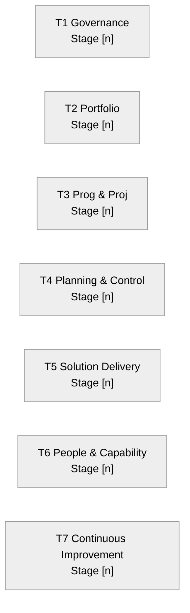

# GovS 002 Continuous Improvement Assessment Framework (CIAF) — [ORGANISATION_OR_PROGRAMME]

> **Template Origin**: Community | **ArcKit Version**: [VERSION] | **Command**: `/arckit:uk-teal-ciaf`

## Document Control

<!-- DOC-CONTROL-HEADER -->
<!-- Resolved at command-execution time per _partials/RENDERING.md. -->

## Revision History

| Version | Date | Author | Changes | Approved By | Approval Date |
|---|---|---|---|---|---|
| [VERSION] | [YYYY-MM-DD] | ArcKit AI | Initial creation from `/arckit:uk-teal-ciaf` command | PENDING | PENDING |

---

## How to use this assessment

This is a **CIAF self-assessment**: it is completed by the delivery organisation about its own project-delivery capability. It **draws on but does not replace** the GovS 002 Project Delivery Functional Standard, and it does **not** constitute independent assurance, an IPA/NISTA review, or a gateway-review outcome. The stage ratings recorded here must be evidenced and then **validated by the organisation's Project Delivery function and the relevant SRO** before they are relied upon, quoted in a business case, or reported to NISTA.

> **Teal Book V1 trial period**: the Teal Book is at **V1** and in a **trial period to 31 December 2026**. Its structure, practices, and the CIAF instrument itself may change. Verify the theme list and maturity criteria against the live source (<https://projectdelivery.gov.uk/teal-book/home/>) and the published CIAF product before reliance.

---

## Assessment scope

| Field | Value |
|---|---|
| **Subject of assessment** | [Organisation / departmental PMO / specific portfolio / programme / project] |
| **Organisational / programme context** | [Brief description of the delivery setting and what is in scope] |
| **Delivery level assessed** | [Portfolio / Programme / Project / Function-wide] |
| **GovS 002 version in scope** | [Functional Standard version — verify against source] |
| **Teal Book version in scope** | V1 (trial period to 31 December 2026) — verify against source |
| **CIAF instrument source** | [Published CIAF product reference / version] |
| **Theme list used** | [Seven Project-Delivery themes below / canonical published list — note any variance] |
| **Assessment date** | [YYYY-MM-DD] |
| **Assessed by** | [Name(s) and role(s)] |
| **Evidence basis** | [Self-asserted / documented evidence / mixed — see per-theme citations] |

> If the canonical published CIAF theme list differs from the seven themes below, the **canonical list is used** and the variance is recorded here: [VARIANCE NOTE, or "no variance — published list matches".]

---

## Four-stage maturity scale

| Stage | Descriptor |
|---|---|
| **Stage 1 — Initial / Aware** | Practices are ad hoc, inconsistent or absent; reliance on individuals; little documented evidence. |
| **Stage 2 — Developing / Repeatable** | Practices defined in places and applied on some work; coverage and consistency are partial; evidence is patchy. |
| **Stage 3 — Established / Defined** | Practices are standardised, consistently applied and evidenced across the portfolio/programme; aligned to GovS 002. |
| **Stage 4 — Optimising / Embedded** | Practices are embedded, measured, and continuously improved; the organisation learns and adapts; clearly exceeds the baseline. |

---

## Executive summary

[One to two paragraphs: the capability assessed, the overall capability stage and how it was derived, the strongest and weakest themes, the most urgent gaps, and the headline of the continuous-improvement roadmap. Note explicitly that this is a self-assessment requiring validation.]

| Item | Value |
|---|---|
| **Overall capability stage** | [Stage 1–4] |
| **Aggregation method** | [Modal / weighted / lowest-of-key-themes — state which and why] |
| **Themes assessed** | [count] |
| **Themes at Stage 1 (priority)** | [list, or "none"] |
| **Improvement actions generated** | [count] |

---

## Theme-by-theme assessment

For each theme: current stage, evidence cited, target stage, the gap, and prioritised improvement actions with an owner role and an indicative timescale (Now / Next / Later, or a quarter). Where no documented evidence exists, mark `[NO EVIDENCE — self-asserted]` and cap the stage accordingly — do not assert Stage 3/4 from intent alone.

### Theme 1 — Governance & roles for portfolios, programmes and projects

*Applies generally across all delivery levels.*

| Attribute | Assessment |
|---|---|
| **Current stage** | [Stage 1–4] |
| **Justification** | [Why this stage — concise] |
| **Evidence cited** | [Artefacts / `external/` documents / stated practice, with `[DOC_ID-CN]` markers; or `[NO EVIDENCE — self-asserted]`] |
| **Target stage** | [Stage 1–4] |
| **Gap (current → target)** | [What is missing to reach target] |

**Improvement actions**

| # | Action | Owner role | Timescale |
|---|---|---|---|
| 1.1 | [Action] | [Role] | [Now / Next / Later] |

### Theme 2 — Portfolio management practices

*Portfolio level.*

| Attribute | Assessment |
|---|---|
| **Current stage** | [Stage 1–4] |
| **Justification** | [Concise] |
| **Evidence cited** | [Citations or `[NO EVIDENCE — self-asserted]`] |
| **Target stage** | [Stage 1–4] |
| **Gap (current → target)** | [Gap] |

**Improvement actions**

| # | Action | Owner role | Timescale |
|---|---|---|---|
| 2.1 | [Action] | [Role] | [Now / Next / Later] |

### Theme 3 — Programme & project management practices

*Programme / project level — detailed practice criteria.*

| Attribute | Assessment |
|---|---|
| **Current stage** | [Stage 1–4] |
| **Justification** | [Concise] |
| **Evidence cited** | [Citations or `[NO EVIDENCE — self-asserted]`] |
| **Target stage** | [Stage 1–4] |
| **Gap (current → target)** | [Gap] |

**Practice criteria observed** (illustrative — confirm against the live CIAF product)

| Practice | Observed? | Stage indication | Evidence |
|---|---|---|---|
| Business case / benefits management | [Yes / Partial / No] | [1–4] | |
| Stakeholder engagement | [Yes / Partial / No] | [1–4] | |
| Project / programme organisation & roles | [Yes / Partial / No] | [1–4] | |
| Life-cycle, stages and decision gates | [Yes / Partial / No] | [1–4] | |

**Improvement actions**

| # | Action | Owner role | Timescale |
|---|---|---|---|
| 3.1 | [Action] | [Role] | [Now / Next / Later] |

### Theme 4 — Planning & control practices

*Programme / project level — detailed practice criteria.*

| Attribute | Assessment |
|---|---|
| **Current stage** | [Stage 1–4] |
| **Justification** | [Concise] |
| **Evidence cited** | [Citations or `[NO EVIDENCE — self-asserted]`] |
| **Target stage** | [Stage 1–4] |
| **Gap (current → target)** | [Gap] |

**Practice criteria observed** (illustrative — confirm against the live CIAF product)

| Practice | Observed? | Stage indication | Evidence |
|---|---|---|---|
| Schedule / planning | [Yes / Partial / No] | [1–4] | |
| Cost & finance control | [Yes / Partial / No] | [1–4] | |
| Risk & issue management (Orange Book) | [Yes / Partial / No] | [1–4] | |
| Change & dependency control | [Yes / Partial / No] | [1–4] | |
| Reporting & management information | [Yes / Partial / No] | [1–4] | |

**Improvement actions**

| # | Action | Owner role | Timescale |
|---|---|---|---|
| 4.1 | [Action] | [Role] | [Now / Next / Later] |

### Theme 5 — Solution-delivery practices

*Programme / project level — detailed practice criteria.*

| Attribute | Assessment |
|---|---|
| **Current stage** | [Stage 1–4] |
| **Justification** | [Concise] |
| **Evidence cited** | [Citations or `[NO EVIDENCE — self-asserted]`] |
| **Target stage** | [Stage 1–4] |
| **Gap (current → target)** | [Gap] |

**Practice criteria observed** (illustrative — confirm against the live CIAF product)

| Practice | Observed? | Stage indication | Evidence |
|---|---|---|---|
| Requirements management | [Yes / Partial / No] | [1–4] | |
| Design & architecture | [Yes / Partial / No] | [1–4] | |
| Build, integration & test | [Yes / Partial / No] | [1–4] | |
| Transition & deployment into operation | [Yes / Partial / No] | [1–4] | |

**Improvement actions**

| # | Action | Owner role | Timescale |
|---|---|---|---|
| 5.1 | [Action] | [Role] | [Now / Next / Later] |

### Theme 6 — People & capability

*Applies generally — detailed practice criteria.*

| Attribute | Assessment |
|---|---|
| **Current stage** | [Stage 1–4] |
| **Justification** | [Concise] |
| **Evidence cited** | [Citations or `[NO EVIDENCE — self-asserted]`] |
| **Target stage** | [Stage 1–4] |
| **Gap (current → target)** | [Gap] |

**Practice criteria observed** (illustrative — confirm against the live CIAF product)

| Practice | Observed? | Stage indication | Evidence |
|---|---|---|---|
| Role definition & competency framework | [Yes / Partial / No] | [1–4] | |
| Capacity & resourcing of delivery roles | [Yes / Partial / No] | [1–4] | |
| Professional development & accreditation | [Yes / Partial / No] | [1–4] | |

**Improvement actions**

| # | Action | Owner role | Timescale |
|---|---|---|---|
| 6.1 | [Action] | [Role] | [Now / Next / Later] |

### Theme 7 — Continuous improvement & learning

*Applies generally — detailed practice criteria.*

| Attribute | Assessment |
|---|---|
| **Current stage** | [Stage 1–4] |
| **Justification** | [Concise] |
| **Evidence cited** | [Citations or `[NO EVIDENCE — self-asserted]`] |
| **Target stage** | [Stage 1–4] |
| **Gap (current → target)** | [Gap] |

**Practice criteria observed** (illustrative — confirm against the live CIAF product)

| Practice | Observed? | Stage indication | Evidence |
|---|---|---|---|
| Lessons-learned capture & reuse | [Yes / Partial / No] | [1–4] | |
| Assurance findings acted upon | [Yes / Partial / No] | [1–4] | |
| Maturity measured & improvement tracked | [Yes / Partial / No] | [1–4] | |

**Improvement actions**

| # | Action | Owner role | Timescale |
|---|---|---|---|
| 7.1 | [Action] | [Role] | [Now / Next / Later] |

---

## Scoring summary & capability heat-map

| # | Theme | Current stage | Target stage | Gap | Priority |
|---|---|---|---|---|---|
| 1 | Governance & roles | [1–4] | [1–4] | [Δ] | [High / Med / Low] |
| 2 | Portfolio management | [1–4] | [1–4] | [Δ] | [High / Med / Low] |
| 3 | Programme & project management | [1–4] | [1–4] | [Δ] | [High / Med / Low] |
| 4 | Planning & control | [1–4] | [1–4] | [Δ] | [High / Med / Low] |
| 5 | Solution delivery | [1–4] | [1–4] | [Δ] | [High / Med / Low] |
| 6 | People & capability | [1–4] | [1–4] | [Δ] | [High / Med / Low] |
| 7 | Continuous improvement & learning | [1–4] | [1–4] | [Δ] | [High / Med / Low] |
| — | **Overall** | **[1–4]** | **[1–4]** | — | — |

**Aggregation method**: [Modal stage / weighted / lowest-of-key-themes — state the method and rationale. A single Stage 1 in a critical governance theme may warrant a lower overall statement than a mean would suggest.]

*Optional capability heat-map (Mermaid):*

---

## Overall capability statement

[A short narrative statement of the organisation's current project-delivery capability against GovS 002 and the Teal Book: where it is strong, where it is weak, the overall stage and what that means in practice, and the headline improvement priorities. State explicitly that this is a self-assessment pending validation by the Project Delivery function and SRO.]

---

## Continuous-improvement roadmap

Sequence the improvement actions into Now / Next / Later horizons with owners, dependencies, and the expected stage uplift per theme. Every theme below its target stage must have at least one action.

### Now (0–3 months)

| Action | Theme(s) | Owner role | Dependencies | Expected uplift |
|---|---|---|---|---|
| [Action] | [Theme #] | [Role] | [Dependency / none] | [Stage x → y] |

### Next (3–9 months)

| Action | Theme(s) | Owner role | Dependencies | Expected uplift |
|---|---|---|---|---|
| [Action] | [Theme #] | [Role] | [Dependency / none] | [Stage x → y] |

### Later (9+ months)

| Action | Theme(s) | Owner role | Dependencies | Expected uplift |
|---|---|---|---|---|
| [Action] | [Theme #] | [Role] | [Dependency / none] | [Stage x → y] |

> Route these actions onward: `/arckit:roadmap` to sequence them into a phased delivery roadmap, and `/arckit:uk-teal-tailoring` to tailor the specific Teal Book practices the assessment found weak.

---

## External References

| Doc ID | Title | Source | Used in |
|---|---|---|---|
| TEAL-HOME | The Teal Book (home) | NISTA / projectdelivery.gov.uk | Throughout |
| TEAL-CONTENTS | The Teal Book — full contents | NISTA / projectdelivery.gov.uk | Scope, themes |
| TEAL-STRUCTURE | The Teal Book — structure | NISTA / projectdelivery.gov.uk | Scope, themes |
| GOVS-002 | GovS 002 Project Delivery Functional Standard | UK Government / GOV.UK | Throughout |
| CIAF | Continuous Improvement Assessment Framework (project delivery) | NISTA / projectdelivery.gov.uk | Themes, scoring |
| GREEN-BOOK | HM Treasury Green Book (appraisal and evaluation) | HM Treasury / GOV.UK | Theme 3 (business case) |
| NISTA | National Infrastructure and Service Transformation Authority | GOV.UK | Stewardship, scope |

> **Verify against source before relying on this output.** projectdelivery.gov.uk and gov.uk publications are updated without prior notice, and the Teal Book is at V1 in a trial period to 31 December 2026. Where a source could not be retrieved at generation time (e.g. HTTP 403), it is still cited above as the authoritative anchor with this caveat.

---

**Generated by**: ArcKit `/arckit:uk-teal-ciaf` command
**Generated on**: [YYYY-MM-DD]
**ArcKit Version**: [VERSION]
**Project**: [PROJECT_NAME]
**Model**: [AI_MODEL]
