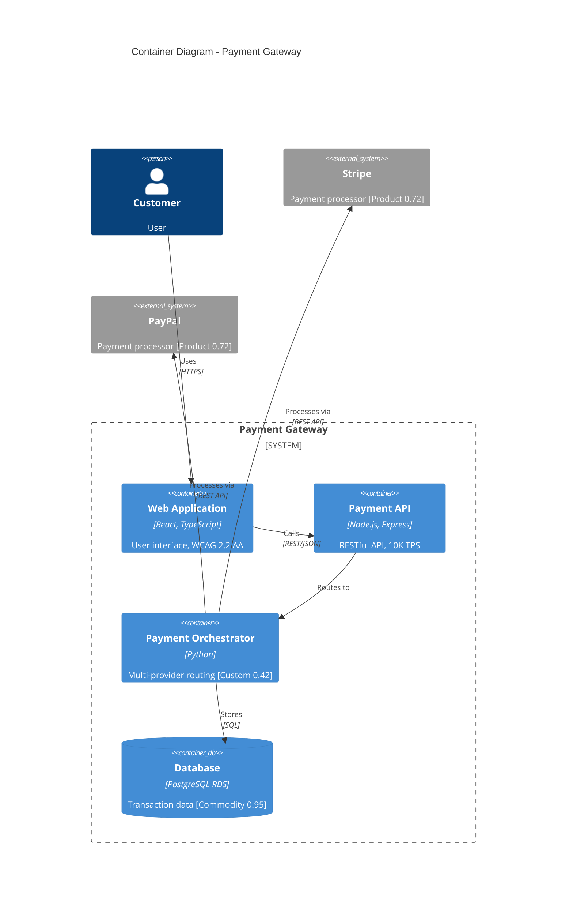
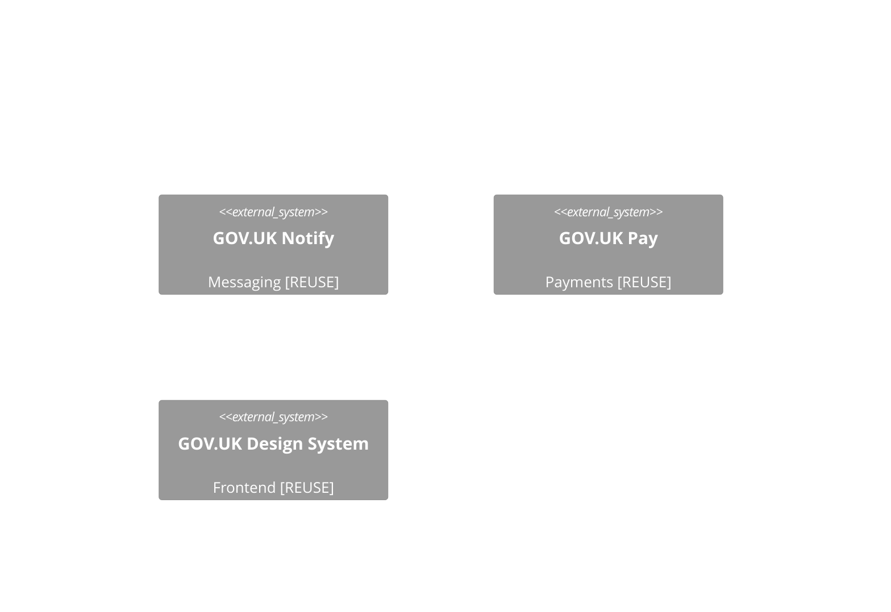
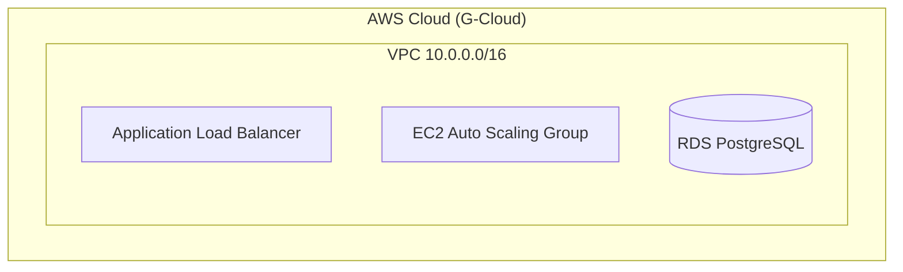
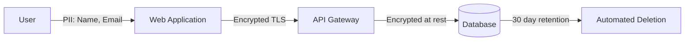

# ArcKit - Enterprise Architecture Governance Toolkit

**Build better enterprise architecture through structured governance, vendor procurement, and design review workflows.**

ArcKit is a toolkit for enterprise architects that transforms architecture governance from scattered documents into a systematic, AI-assisted workflow for:
- 🏛️ Establishing and enforcing architecture principles
- 📋 Creating comprehensive requirements documents
- 🗺️ Strategic planning with Wardley Mapping
- 📊 Generating visual architecture diagrams (Mermaid)
- 🤝 Managing vendor RFP and selection processes
- ✅ Conducting formal design reviews (HLD/DLD)
- 🔗 Maintaining requirements traceability

---

## Quick Start

### Installation

Install ArcKit CLI:

```bash
# Install with pip
pip install git+https://github.com/tractorjuice/arc-kit.git

# Or with uv
uv tool install arckit-cli --from git+https://github.com/tractorjuice/arc-kit.git

# Or run without installing
uvx --from git+https://github.com/tractorjuice/arc-kit.git arckit init my-project
```

**Latest Release**: [v0.1.0](https://github.com/tractorjuice/arc-kit/releases/tag/v0.1.0)

### Initialize a Project

```bash
# Create a new architecture governance project
arckit init payment-modernization --ai claude

# Or initialize in current directory
arckit init . --ai claude
```

### Start Using ArcKit

```bash
cd payment-modernization
claude  # or your chosen AI assistant

# Inside your AI assistant, use ArcKit commands:
/arckit.principles Create principles for a financial services company
/arckit.requirements Build a payment processing system...
/arckit.sow Generate RFP for vendor selection
```

---

## The ArcKit Workflow

ArcKit guides you through the enterprise architecture lifecycle:

### Phase 1: Establish Governance
**`/arckit.principles`** → Create enterprise architecture principles

Define your organization's architecture standards:
- Cloud strategy (AWS/Azure/GCP)
- Security frameworks (Zero Trust, compliance)
- Technology standards
- FinOps and cost governance

### Phase 2: Define Requirements
**`/arckit.requirements`** → Document comprehensive requirements

Create detailed requirements with:
- Business requirements with rationale
- Functional requirements with acceptance criteria
- Non-functional requirements (performance, security, scalability, compliance)
- Integration requirements
- Success criteria and KPIs

### Phase 2.5: Strategic Planning with Wardley Mapping
**`/arckit.wardley`** → Create strategic Wardley Maps

Visualize strategic positioning with:
- Component evolution analysis (Genesis → Custom → Product → Commodity)
- Build vs Buy decision framework
- Vendor comparison and procurement strategy
- UK Government Digital Marketplace mapping
- Evolution predictions and strategic gameplay

### Phase 3: Vendor Procurement (if needed)
**`/arckit.sow`** → Generate Statement of Work (RFP)

Create RFP-ready documents with:
- Scope of work and deliverables
- Technical requirements
- Vendor qualifications
- Evaluation criteria
- Contract terms

**`/arckit.evaluate`** → Create vendor evaluation framework

Set up systematic scoring:
- Technical evaluation criteria (100 points)
- Cost evaluation methodology
- Reference check templates
- Decision matrix

**`/arckit.evaluate`** (compare mode) → Compare vendor proposals

Side-by-side analysis of:
- Technical approaches
- Cost breakdowns
- Risk assessments
- Value propositions

### Phase 4: Design Review
**`/arckit.hld-review`** → Review High-Level Design

Validate designs against:
- Architecture principles compliance
- Requirements coverage
- Security and compliance
- Scalability and resilience
- Operational readiness

**`/arckit.dld-review`** → Review Detailed Design

Implementation-ready validation:
- Component specifications
- API contracts (OpenAPI)
- Database schemas
- Security implementation
- Test strategy

### Phase 5: Traceability
**`/arckit.traceability`** → Generate traceability matrix

Ensure complete coverage:
- Requirements → Design mapping
- Design → Test mapping
- Gap analysis and orphan detection
- Change impact tracking

---

## Why ArcKit?

### Problem: Architecture Governance is Broken

Traditional enterprise architecture suffers from:
- ❌ Scattered documents across tools (Word, Confluence, PowerPoint)
- ❌ Inconsistent governance enforcement
- ❌ Manual vendor evaluation with bias
- ❌ Lost traceability between requirements and design
- ❌ Stale documentation that doesn't match reality

### Solution: Structured, AI-Assisted Governance

ArcKit provides:
- ✅ **Template-Driven Quality**: Comprehensive templates ensure nothing is forgotten
- ✅ **Systematic Workflows**: Clear processes from requirements → procurement → design review
- ✅ **AI Assistance**: Let AI handle document generation, you focus on decisions
- ✅ **Enforced Traceability**: Automatic gap detection and coverage analysis
- ✅ **Version Control**: Git-based workflow for all architecture artifacts

---

## Supported AI Agents

| Agent | Support | Notes |
|-------|---------|-------|
| [Claude Code](https://www.anthropic.com/claude-code) | ✅ | Recommended |
| [GitHub Copilot](https://code.visualstudio.com/) | ✅ | |
| [Cursor](https://cursor.sh/) | ✅ | |
| [Gemini CLI](https://github.com/google-gemini/gemini-cli) | ✅ | |

---

## Example: Payment Modernization Project

```bash
# 1. Initialize project
arckit init payment-modernization --ai claude
cd payment-modernization
claude

# 2. Establish principles
/arckit.principles Create principles for PCI-DSS compliant payment processing with 99.99% availability

# 3. Document requirements
/arckit.requirements Build a payment gateway that processes credit cards, supports 10K TPS,
complies with PCI-DSS Level 1, integrates with Stripe and PayPal, and provides real-time
fraud detection

# 4. Create strategic Wardley Map for build vs buy decisions
/arckit.wardley Create current state Wardley Map for payment gateway showing build vs buy strategy

# 5. Generate SOW for vendor RFP
/arckit.sow Generate RFP for vendor selection with 12-month timeline and $2M budget

# 6. After receiving vendor proposals...
/arckit.evaluate Create evaluation framework

# 7. Score vendors
/arckit.evaluate Compare all vendors for payment gateway project

# 8. Review selected vendor's HLD
/arckit.hld-review Review Acme Corp's high-level design

# 9. Review detailed design
/arckit.dld-review Review Acme Corp's detailed design for payment service

# 10. Ensure traceability
/arckit.traceability Generate matrix from requirements through design to tests
```

---

## Project Structure

ArcKit creates this structure:

```
payment-modernization/
├── .arckit/
│   ├── memory/
│   │   └── architecture-principles.md    # Global principles
│   ├── scripts/
│   │   └── bash/                          # Automation scripts
│   └── templates/                         # Document templates
├── projects/
│   └── 001-payment-gateway/
│       ├── requirements.md                 # Comprehensive requirements
│       ├── wardley-maps/                   # Strategic Wardley Maps
│       │   ├── current-state.md            # Current architecture positioning
│       │   ├── future-state.md             # Target architecture vision
│       │   ├── gap-analysis.md             # Current vs future comparison
│       │   └── procurement-strategy.md     # Build vs buy decisions
│       ├── sow.md                          # Statement of Work (RFP)
│       ├── evaluation-criteria.md          # Vendor evaluation framework
│       ├── vendors/
│       │   ├── acme-corp/
│       │   │   ├── proposal.pdf
│       │   │   ├── scoring.md
│       │   │   ├── hld-v1.md
│       │   │   └── reviews/
│       │   │       └── hld-v1-review.md
│       │   ├── beta-systems/
│       │   │   └── ...
│       │   └── comparison.md
│       ├── traceability-matrix.md
│       └── final/
│           ├── selected-vendor.md
│           ├── approved-hld.md
│           └── dld/
└── .claude/commands/                      # AI assistant commands
```

---

## Available Commands

### Core Commands

| Command | Purpose | Output |
|---------|---------|--------|
| `/arckit.principles` | Establish architecture governance | `memory/architecture-principles.md` |
| `/arckit.requirements` | Define comprehensive requirements | `projects/XXX/requirements.md` |
| `/arckit.sow` | Generate vendor RFP | `projects/XXX/sow.md` |

### Vendor Management

| Command | Purpose | Output |
|---------|---------|--------|
| `/arckit.evaluate` | Create evaluation framework and score vendors | `projects/XXX/evaluation-criteria.md`, `projects/XXX/vendor-comparison.md` |

### Design Review

| Command | Purpose | Output |
|---------|---------|--------|
| `/arckit.hld-review` | Review high-level design | `projects/XXX/vendors/[vendor]/reviews/hld-review.md` |
| `/arckit.dld-review` | Review detailed design | `projects/XXX/vendors/[vendor]/reviews/dld-review.md` |

### Strategic Planning

| Command | Purpose | Output |
|---------|---------|--------|
| `/arckit.wardley` | Create strategic Wardley Maps for build vs buy and procurement strategy | `projects/XXX/wardley-maps/{map-name}.md` |

### Architecture Diagrams

| Command | Purpose | Output |
|---------|---------|--------|
| `/arckit.diagram` | Generate visual architecture diagrams using Mermaid (C4, deployment, sequence, data flow) | `projects/XXX/diagrams/{diagram-type}-{name}.md` |

### Traceability

| Command | Purpose | Output |
|---------|---------|--------|
| `/arckit.traceability` | Generate traceability matrix | `projects/XXX/traceability-matrix.md` |

### Quality Assurance

| Command | Purpose | Output |
|---------|---------|--------|
| `/arckit.analyze` | Comprehensive governance quality analysis across all artifacts | Analysis report (read-only) |

### UK Government

| Command | Purpose | Output |
|---------|---------|--------|
| `/arckit.tcop` | Assess Technology Code of Practice compliance | `projects/XXX/tcop-assessment.md` |
| `/arckit.ai-playbook` | Assess AI Playbook compliance for responsible AI | `projects/XXX/ai-playbook-assessment.md` |
| `/arckit.atrs` | Generate Algorithmic Transparency Recording Standard (ATRS) record | `projects/XXX/atrs-record.md` |

---

## Wardley Mapping for Strategic Architecture

**ArcKit integrates Wardley Mapping for strategic situational awareness and build vs buy decision-making.**

### What is Wardley Mapping?

Wardley Mapping is a strategic visualization technique that helps you:
- **Map the value chain**: From user needs → capabilities → components
- **Position by evolution**: Genesis (novel) → Custom → Product → Commodity
- **Identify movement**: How components evolve over time
- **Make strategic decisions**: Build vs Buy, vendor selection, technology choices

### Evolution Stages

| Stage | Evolution | Strategic Action | Example |
|-------|-----------|------------------|---------|
| **Genesis** | 0.00-0.25 | Build only if strategic differentiator, R&D focus | Novel AI algorithm, new protocol |
| **Custom** | 0.25-0.50 | Critical build vs buy decision, invest in IP | Custom integration, specialized service |
| **Product** | 0.50-0.75 | Buy from vendors, compare features | Salesforce, Oracle, SAP |
| **Commodity** | 0.75-1.00 | Always use commodity/cloud, never build | AWS S3, Auth0, PostgreSQL |

### Wardley Mapping in ArcKit

The `/arckit.wardley` command creates strategic maps for:

**Current State Mapping**:
- Understand existing system landscape
- Identify technical debt and inertia
- Baseline for transformation

**Future State Mapping**:
- Visualize target architecture
- Plan evolution paths
- Strategic roadmap development

**Gap Analysis**:
- Compare current vs future state
- Prioritize investments
- Identify migration paths

**Vendor Comparison**:
- Compare vendor proposals strategically
- Assess vendor lock-in risks
- Validate vendor evolution positioning

**Procurement Strategy** (UK Government):
- Map components to Digital Marketplace frameworks
- Identify GOV.UK service reuse opportunities
- Align with Technology Code of Practice

### Example: Benefits Eligibility Chatbot (UK Government)

```bash
# Create Wardley Map for procurement strategy
/arckit.wardley Create procurement strategy Wardley Map for DWP benefits eligibility chatbot

# Map output shows:
# - BUILD: Benefits rules engine (Custom, 0.42) - domain expertise
# - BUILD: Human review queue (Custom, 0.45) - HIGH-RISK AI requirement
# - BUY (G-Cloud): GPT-4 (Product, 0.72) - commercial LLM
# - BUY (G-Cloud): Cloud hosting (Commodity, 0.95) - AWS via G-Cloud
# - REUSE: GOV.UK Notify (Commodity, 0.92) - email/SMS notifications
# - REUSE: GOV.UK Design System (Product, 0.75) - accessibility compliance
```

**Strategic Insights**:
- 40% build (competitive advantage components)
- 35% buy via G-Cloud (commodity/product components)
- 25% reuse GOV.UK services (avoid duplication)

### Wardley Mapping Integration

Wardley Maps integrate throughout the ArcKit workflow:

- **Requirements Phase**: Identify components and evolution stages
- **Procurement Phase**: Guide build vs buy decisions
- **Vendor Evaluation**: Compare vendor architectures strategically
- **Design Review**: Validate designs against strategic positioning
- **Analysis**: Detect misaligned decisions (building commodity components)

### Visualization

All Wardley Maps use the **OnlineWardleyMaps** format and can be visualized at:

**[https://create.wardleymaps.ai](https://create.wardleymaps.ai)**

Simply paste the map code from the generated document to see the visual map.

---

## Architecture Diagrams with Mermaid

**ArcKit generates visual architecture diagrams using Mermaid for clear technical communication.**

### What are Architecture Diagrams?

Architecture diagrams visualize system structure, interactions, and deployment for:
- **Technical Communication**: Share architecture with stakeholders
- **Design Documentation**: Document current and future state
- **Vendor Evaluation**: Compare vendor technical approaches
- **UK Government Compliance**: Visualize Cloud First, GOV.UK services, PII handling

### Diagram Types

ArcKit supports 6 essential diagram types based on the C4 Model and enterprise architecture best practices:

| Diagram Type | Level | Purpose | When to Use |
|--------------|-------|---------|-------------|
| **C4 Context** | Level 1 | System in context with users and external systems | After requirements, to show system boundaries |
| **C4 Container** | Level 2 | Technical containers and technology choices | After HLD, for vendor review |
| **C4 Component** | Level 3 | Internal components within a container | After DLD, for implementation |
| **Deployment** | Infrastructure | Cloud resources and network topology | Cloud First compliance, cost estimation |
| **Sequence** | Interaction | API flows and request/response patterns | Integration requirements, API design |
| **Data Flow** | Data | How data moves, PII handling, GDPR compliance | UK GDPR, DPIA requirements |

### Using /arckit.diagram

The `/arckit.diagram` command generates diagrams automatically from your architecture artifacts:

```bash
# Auto-detect diagram type from context
/arckit.diagram Generate architecture diagram for payment gateway

# Explicit diagram type
/arckit.diagram context Generate C4 context diagram for benefits chatbot
/arckit.diagram container Generate C4 container diagram showing AWS services
/arckit.diagram component Generate component diagram for payment orchestrator
/arckit.diagram deployment Generate deployment diagram for production environment
/arckit.diagram sequence Generate sequence diagram for payment authorization flow
/arckit.diagram dataflow Generate data flow diagram showing PII handling for UK GDPR
```

### Strategic Integration with Wardley Maps

Diagrams integrate with Wardley Maps to show strategic positioning:



**Note**: Components are annotated with evolution stages from Wardley Map:
- `[Custom 0.42]` = Build (competitive advantage)
- `[Product 0.72]` = Buy from vendor
- `[Commodity 0.95]` = Use cloud/utility service

### UK Government Compliance in Diagrams

Diagrams automatically include UK Government compliance elements:

**GOV.UK Services**:


**Cloud First (TCoP Point 5)**:


**PII Handling (UK GDPR)**:


### Example: Benefits Eligibility Chatbot (UK Government)

```bash
# 1. Context diagram - system boundaries
/arckit.diagram context Generate C4 context diagram for DWP benefits eligibility chatbot

# Output shows:
# - Users: Citizens, DWP case workers, administrators
# - System: Benefits eligibility chatbot (HIGH-RISK AI)
# - External: GOV.UK Notify, GOV.UK Design System, DWP benefits database

# 2. Container diagram - technical architecture
/arckit.diagram container Generate container diagram showing GOV.UK services and AWS

# Output shows:
# - Frontend: GOV.UK Design System (WCAG 2.2 AA) [REUSE]
# - Backend: Node.js API, GPT-4 (via Azure) [BUY]
# - Custom: Benefits rules engine [BUILD 0.42], Human review queue [BUILD 0.45]
# - Data: PostgreSQL RDS [USE 0.95], S3 audit logs [USE 0.98]
# - Integrations: GOV.UK Notify [REUSE], DWP benefits API

# 3. Data flow diagram - UK GDPR compliance
/arckit.diagram dataflow Generate data flow diagram showing PII handling and GDPR compliance

# Output shows:
# - PII types: Name, NI number, address, financial data
# - Legal basis: Public task (Article 6(1)(e))
# - Retention: 6 years (aligned with DWP retention schedule)
# - Encryption: TLS 1.3 in transit, AES-256 at rest
# - DPIA: Required (HIGH-RISK AI processing sensitive data)
```

### Diagram Integration Throughout Workflow

Architecture diagrams integrate with the full ArcKit workflow:

- **Requirements Phase**: Generate context diagrams to visualize system boundaries
- **Procurement Phase**: Create deployment diagrams for cost estimation
- **Vendor Evaluation**: Compare vendor container diagrams side-by-side
- **HLD Review**: Validate container diagrams against architecture principles
- **DLD Review**: Review component diagrams and sequence diagrams
- **Traceability**: Link components to requirements in traceability matrix

### Component Inventory

All diagrams include a component inventory table with:

| Component | Type | Technology | Responsibility | Evolution Stage | Build/Buy |
|-----------|------|------------|----------------|-----------------|--------------|
| Payment Orchestrator | Service | Python | Multi-provider routing | Custom 0.42 | BUILD |
| Database | Data Store | PostgreSQL RDS | Transaction persistence | Commodity 0.95 | USE |
| Stripe Integration | External API | REST | Credit card processing | Product 0.72 | BUY |

**Evolution Stage Legend**:
- **Genesis (0.0-0.25)**: Novel, unproven, rapidly changing → BUILD only if strategic differentiator
- **Custom (0.25-0.50)**: Bespoke, emerging practices → Critical BUILD vs BUY decision
- **Product (0.50-0.75)**: Commercial products with features → BUY from vendors
- **Commodity (0.75-1.0)**: Utility services, standardized → USE cloud/commodity services

### Visualization

All diagrams use **Mermaid syntax** and can be visualized:

**GitHub**: Renders automatically in markdown preview
**VS Code**: Install [Mermaid Preview extension](https://marketplace.visualstudio.com/items?itemName=vstirbu.vscode-mermaid-preview)
**Online**: [https://mermaid.live](https://mermaid.live) - paste code to visualize
**Export**: Use mermaid.live to export as PNG/SVG/PDF

### Example Output Structure

```
projects/001-payment-gateway/
├── diagrams/
│   ├── context-payment-gateway.md         # C4 Level 1
│   ├── container-payment-gateway.md       # C4 Level 2
│   ├── component-orchestrator.md          # C4 Level 3
│   ├── deployment-production.md           # Infrastructure
│   ├── sequence-payment-flow.md           # API interactions
│   └── dataflow-pii-handling.md           # UK GDPR compliance
```

Each diagram includes:
- Mermaid code (copy-paste ready)
- Component inventory with evolution stages
- Architecture decisions and rationale
- Requirements traceability
- Security controls
- UK Government compliance (if applicable)
- Change log and versioning

---

## UK Government Support

**ArcKit fully supports UK Government Technology Code of Practice (TCoP) and AI Playbook compliance.**

### Technology Code of Practice Assessment

The `/arckit.tcop` command helps UK government departments and public sector organizations assess compliance with all 13 TCoP points:

1. ✅ Define User Needs
2. ✅ Make Things Accessible and Inclusive
3. ✅ Be Open and Use Open Source
4. ✅ Make Use of Open Standards
5. ✅ Use Cloud First
6. ✅ Make Things Secure
7. ✅ Make Privacy Integral
8. ✅ Share, Reuse and Collaborate
9. ✅ Integrate and Adapt Technology
10. ✅ Make Better Use of Data
11. ✅ Define Your Purchasing Strategy
12. ✅ Make Your Technology Sustainable
13. ✅ Meet the Service Standard

### Example: UK Government Project

```bash
# Initialize project for UK government department
arckit init digital-service-modernization --ai claude
cd digital-service-modernization
claude

# Assess TCoP compliance (Discovery/Alpha/Beta/Live phase)
/arckit.tcop Assess Technology Code of Practice compliance for HMRC tax filing in Beta phase

# Generate requirements aligned with TCoP
/arckit.requirements Define requirements for GOV.UK service with WCAG 2.2 AA accessibility

# Include TCoP in design reviews
/arckit.hld-review Review HLD ensuring Cloud First and Open Standards compliance
```

### AI Playbook Assessment

The `/arckit.ai-playbook` command helps assess compliance with the UK Government AI Playbook for responsible AI deployment:

**10 Core Principles**:
1. ✅ Understanding AI - Capabilities and limitations
2. ✅ Lawful and Ethical Use - DPIA, EqIA, Human Rights
3. ✅ Security - AI-specific threats (prompt injection, data poisoning)
4. ✅ Human Control - Human-in-the-loop for high-risk AI
5. ✅ Lifecycle Management - Selection to decommissioning
6. ✅ Right Tool Selection - AI only when genuinely better
7. ✅ Collaboration - Cross-government, academia, civil society
8. ✅ Commercial Partnership - Responsible AI in contracts
9. ✅ Skills and Expertise - Multidisciplinary teams
10. ✅ Organizational Alignment - Governance and assurance

**6 Ethical Themes**:
- Safety, Security, and Robustness
- Transparency and Explainability (ATRS)
- Fairness, Bias, and Discrimination
- Accountability and Responsibility
- Contestability and Redress
- Societal Wellbeing and Public Good

### Built-in UK Government Support

- **Technology Code of Practice template** with all 13 points
- **AI Playbook template** with 10 principles + 6 ethical themes
- **Algorithmic Transparency Recording Standard (ATRS)** template and generator
- **Service Standard alignment** (Point 13)
- **WCAG 2.2 Level AA** accessibility requirements
- **UK GDPR and DPIA** compliance tracking
- **Digital Marketplace** procurement guidance (G-Cloud, DOS)
- **GOV.UK services integration** (Pay, Notify, Design System)
- **Cyber Essentials** security requirements
- **Open Standards Profile** compliance
- **Greening Government ICT** sustainability requirements
- **AI risk assessment** (High/Medium/Low risk AI systems)

---

## Comparison to Other Tools

| Feature | ArcKit | Sparx EA | Ardoq | LeanIX | Confluence |
|---------|--------|----------|-------|--------|------------|
| **AI-Assisted** | ✅ | ❌ | ❌ | ❌ | ❌ |
| **Wardley Mapping** | ✅ | ❌ | ⚠️ Limited | ❌ | ❌ |
| **Version Control** | ✅ Git | ❌ | ❌ | ❌ | ⚠️ Limited |
| **Vendor RFP** | ✅ | ❌ | ❌ | ❌ | ⚠️ Manual |
| **Design Review Gates** | ✅ | ⚠️ Manual | ❌ | ❌ | ⚠️ Manual |
| **Traceability** | ✅ Automated | ⚠️ Manual | ✅ | ⚠️ Limited | ❌ |
| **Cost** | Free | $$$$ | $$$$ | $$$$ | $$ |
| **Learning Curve** | Low | High | Medium | Medium | Low |

---

## Requirements

- **Python 3.11+**
- **Git** (optional but recommended)
- **AI Coding Agent**: Claude Code, GitHub Copilot, Cursor, or Gemini CLI
- **uv** for package management: [Install uv](https://docs.astral.sh/uv/)

---

## Installation from Source

```bash
# Clone the repository
git clone https://github.com/tractorjuice/arc-kit.git
cd arc-kit

# Install in development mode
pip install -e .

# Run the CLI
arckit init my-project
```

---

## Documentation

- **[Architecture Principles Guide](docs/principles.md)** - How to establish governance
- **[Requirements Guide](docs/requirements.md)** - Writing comprehensive requirements
- **[Vendor Procurement Guide](docs/procurement.md)** - Managing RFP and selection
- **[Design Review Guide](docs/design-review.md)** - Conducting HLD/DLD reviews
- **[Traceability Guide](docs/traceability.md)** - Maintaining requirement coverage

---

## Relationship to Spec Kit

ArcKit is inspired by [Spec Kit](https://github.com/github/spec-kit) but targets a different audience:

| | Spec Kit | ArcKit |
|---|----------|--------|
| **Audience** | Product Managers, Developers | Enterprise Architects, Procurement |
| **Focus** | Feature development (0→1 code generation) | Architecture governance & vendor management |
| **Workflow** | Spec → Plan → Tasks → Code | Requirements → RFP → Design Review → Traceability |
| **Output** | Working code | Architecture documentation & governance |

---

## Contributing

We welcome contributions! Please see [CONTRIBUTING.md](CONTRIBUTING.md) for guidelines.

**Areas we need help**:
- Integration with enterprise tools (Jira, Azure DevOps, ServiceNow)
- Additional AI agent support
- Template improvements based on real-world usage
- Documentation and examples

---

## Support

- **Issues**: [GitHub Issues](https://github.com/tractorjuice/arc-kit/issues)
- **Releases**: [GitHub Releases](https://github.com/tractorjuice/arc-kit/releases)
- **Latest Version**: [v0.1.0](https://github.com/tractorjuice/arc-kit/releases/tag/v0.1.0)

---

## License

MIT License - see [LICENSE](LICENSE) for details

---

## Acknowledgements

ArcKit is inspired by the methodology and patterns from [Spec Kit](https://github.com/github/spec-kit), adapted for enterprise architecture governance workflows.

---

**Built with ❤️ for enterprise architects who want systematic, AI-assisted governance.**
