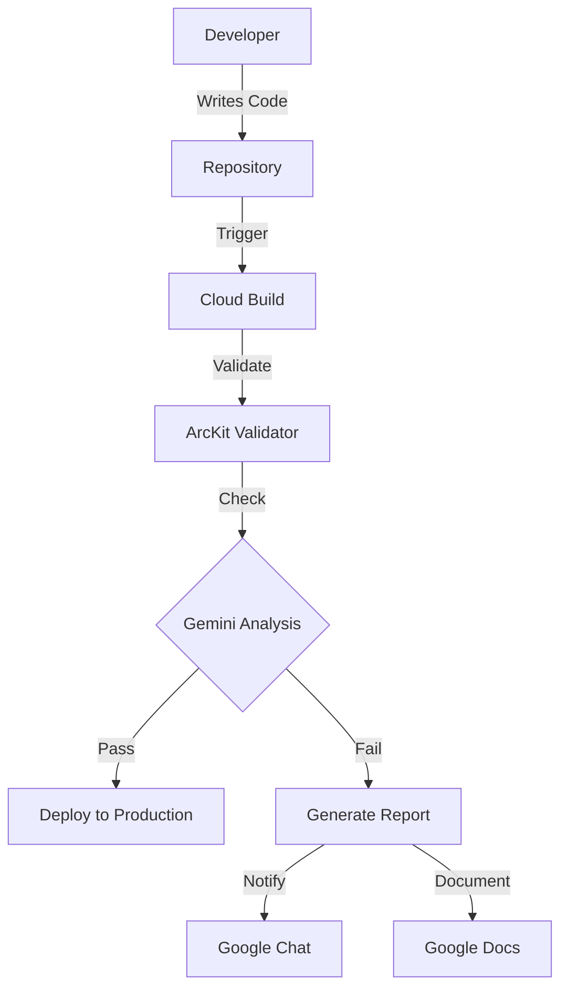
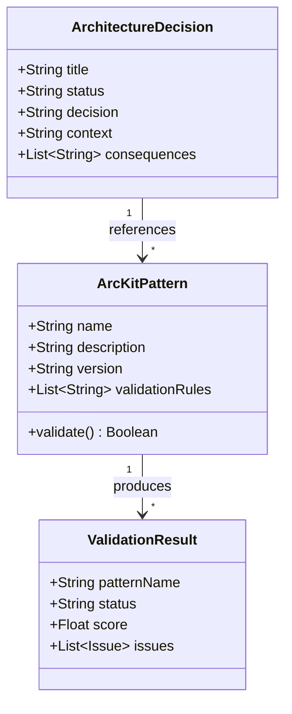
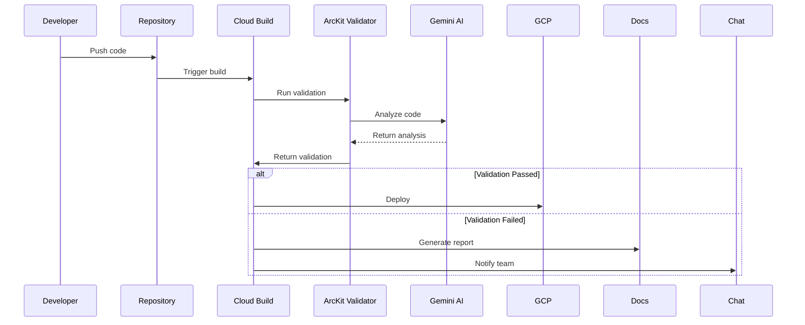
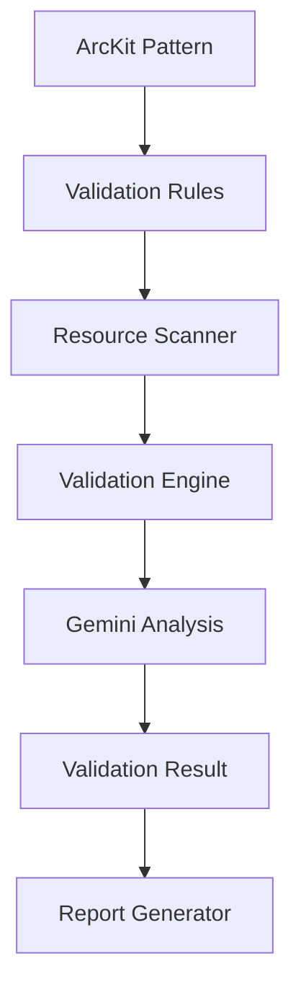
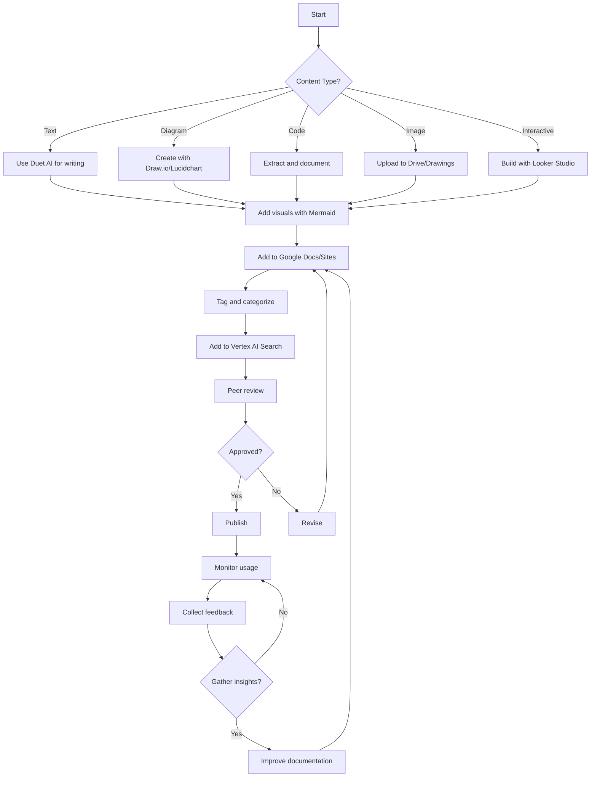

# Multi-Modal Architecture Documentation

## Introduction

Multi-modal architecture documentation represents a paradigm shift from traditional text-only documentation to rich, interactive, and visual documentation that leverages multiple formats including text, diagrams, code, images, and even video. As of July 2026, Google's Gemini models and Google Workspace provide advanced multi-modal capabilities that can transform how enterprises document their architecture decisions, patterns, and governance frameworks.

For organizations deploying ArcKit across Google Cloud, multi-modal documentation enables:
- **Visual Architecture Diagrams**: Auto-generated diagrams from code and configuration
- **Interactive Documentation**: Dynamic documents that users can query and explore
- **Context-Rich Code Documentation**: Code with embedded diagrams, explanations, and references
- **Automated Documentation Generation**: AI-assisted creation of comprehensive documentation
- **Searchable Knowledge Bases**: Multi-modal search across all architecture artifacts

Google's approach to multi-modal documentation combines several technologies:
- **Gemini Vision**: Multi-modal AI that understands images, text, and code together
- **Duet AI in Workspace**: AI-powered assistance in Docs, Sheets, Slides, and Meet
- **Google Drive**: Unified storage for all document types
- **Looker Studio**: Interactive dashboards and visualizations
- **Vertex AI Search**: Semantic search across multi-modal content

## Multi-Modal Documentation Architecture

### Documentation Layers

```
Multi-Modal Architecture Documentation
├── Visual Layer (Diagrams, Images, Videos)
│   ├── Architecture Diagrams (Draw.io, Lucidchart, PlantUML)
│   ├── Sequence Diagrams (Mermaid, PlantUML)
│   ├── Component Diagrams (C4 Model)
│   └── Screenshots and UI Mockups
├── Textual Layer (Traditional Documentation)
│   ├── Architecture Decision Records (ADRs)
│   ├── Pattern Descriptions
│   ├── Implementation Guides
│   └── Governance Policies
├── Code Layer (Executable Documentation)
│   ├── Infrastructure as Code (Terraform, Deployment Manager)
│   ├── Configuration Files (YAML, JSON)
│   ├── Test Cases
│   └── Validation Scripts
├── Interactive Layer (Dynamic Documentation)
│   ├── AI Chat Interfaces
│   ├── Queryable Documentation
│   ├── Interactive Dashboards
│   └── Guided Walkthroughs
└── Metadata Layer (Structured Information)
    ├── Tags and Classifications
    ├── Relationships and Dependencies
    ├── Version History
    └── Compliance Mapping
```

### Google's Multi-Modal Stack for Documentation

```
Google Multi-Modal Documentation Stack
├── Content Creation
│   ├── Google Docs (Duet AI for writing assistance)
│   ├── Google Slides (Visual presentations)
│   ├── Google Drawings (Diagrams and visuals)
│   ├── Google Sheets (Data and metrics)
│   └── Google Sites (Portals and hubs)
├── Content Storage
│   ├── Google Drive (Unified storage)
│   └── Cloud Storage (Scalable artifact storage)
├── Content Processing
│   ├── Vertex AI (Multi-modal analysis)
│   ├── Document AI (Text extraction and understanding)
│   ├── Vision API (Image analysis)
│   └── Natural Language API (Text analysis)
├── Content Discovery
│   ├── Vertex AI Search (Semantic search)
│   ├── Cloud Search (Enterprise search)
│   └── BigQuery (Analytics and insights)
└── Content Delivery
    ├── Looker Studio (Interactive dashboards)
    ├── Google Chat (Collaborative access)
    └── Custom Applications
```

## Visual Architecture Documentation

### Diagram Generation with ArcKit

**1. Automated Diagram Generation from Code**

ArcKit can automatically generate architecture diagrams from infrastructure code and configuration:

```yaml
# ArcKit diagram generation pattern
pattern: diagram-generation
metadata:
  description: "Generate architecture diagrams from infrastructure code"
  multi_modal: true
  
workflows:
  - name: generate-diagram-from-terraform
    description: "Generate diagram from Terraform configuration"
    trigger: file_changes
    files: ["*.tf", "*.tf.json"]
    
    steps:
      - name: parse_terraform
        implementation: terraform_parser
        output: parsed_resources.json
        
      - name: extract_relationships
        implementation: relationship_extractor
        input: parsed_resources.json
        output: relationships.json
        
      - name: generate_plantuml
        implementation: plantuml_generator
        input: relationships.json
        output: architecture.puml
        
      - name: render_diagram
        implementation: diagram_renderer
        input: architecture.puml
        formats: [png, svg, pdf]
        output: architecture.png
        
      - name: store_diagram
        implementation: drive_uploader
        destination: ${GOOGLE_DRIVE_FOLDER}
        filename: "architecture-${COMMIT_SHA}.png"
        
      - name: embed_in_docs
        implementation: docs_embedder
        document: "${ADR_DOCUMENT_ID}"
        image: "architecture-${COMMIT_SHA}.png"
        caption: "Architecture Diagram - Auto-generated from Terraform"
```

**2. C4 Model Diagrams**

The C4 model (Context, Containers, Components, Code) provides a structured approach to visual architecture documentation:

```plantuml
@startuml C4-Context-Diagram
!include https://raw.githubusercontent.com/plantuml-stdlib/C4-PlantUML/master/C4_Context.puml

LAYOUT_WITH_LEGEND()

Person(admin, "Administrator")
Person(user, "End User")

System_Ext(gcp, "Google Cloud Platform", "Hosting provider")

System(arckit, "ArcKit Governance System", "Architecture governance platform")

Rel(admin, arckit, "Configures")
Rel(user, arckit, "Uses")
Rel(arckit, gcp, "Runs on")

@enduml
```

```plantuml
@startuml C4-Container-Diagram
!include https://raw.githubusercontent.com/plantuml-stdlib/C4-PlantUML/master/C4_Container.puml

LAYOUT_WITH_LEGEND()

Container(web, "Web Application", "React", "Serves user interface")
Container(api, "API Gateway", "Cloud Endpoints", "Handles API requests")
Container(validation, "Validation Service", "Cloud Run", "Validates architecture")
Container(storage, "Pattern Storage", "Cloud Storage", "Stores ArcKit patterns")
ContainerDb(database, "Metadata Database", "Firestore", "Stores pattern metadata")

Rel(web, api, "API calls")
Rel(api, validation, "Validation requests")
Rel(validation, storage, "Pattern access")
Rel(validation, database, "Metadata queries")

@enduml
```

**3. Mermaid Diagrams**

Mermaid provides a text-based approach to diagram generation that works well with ArcKit:

````markdown





````

### Interactive Architecture Diagrams

**1. Draw.io Integration**

```yaml
# ArcKit integration with Draw.io
drawio:
  integration:
    enabled: true
    
    templates:
      - name: arckit-architecture
        url: "https://drive.google.com/file/d/drawio-template-id"
        description: "ArcKit architecture diagram template"
        
      - name: arckit-c4-context
        url: "https://drive.google.com/file/d/c4-context-template-id"
        description: "C4 Context diagram template"
        
      - name: arckit-c4-container
        url: "https://drive.google.com/file/d/c4-container-template-id"
        description: "C4 Container diagram template"
    
    automation:
      - trigger: new_pattern
        action: create_diagram_from_template
        template: arckit-architecture
        destination: ${PATTERN_FOLDER}
        filename: "${PATTERN_NAME}-diagram.drawio"
        
      - trigger: validation_failure
        action: highlight_issues
        diagram: ${ARCHITECTURE_DIAGRAM}
        issues: ${VALIDATION_ISSUES}
        
      - trigger: resource_change
        action: update_diagram
        diagram: ${ARCHITECTURE_DIAGRAM}
        changes: ${RESOURCE_CHANGES}
    
    storage:
      location: Google Drive
      folder: "1ABC123"  # Architecture Diagrams folder
      format: drawio
      
    sharing:
      default: ["group:architecture-team@your-org.com"]
      public: false
```

**2. Lucidchart Integration**

```yaml
# ArcKit integration with Lucidchart
lucidchart:
  integration:
    enabled: true
    api_key: ${LUCIDCHART_API_KEY}
    
    folders:
      - id: "LC_FOLDER_123"
        name: "ArcKit Patterns"
        description: "Architecture patterns for ArcKit"
        
      - id: "LC_FOLDER_456"
        name: "Architecture Decisions"
        description: "ADRs and technical decisions"
        
      - id: "LC_FOLDER_789"
        name: "Validation Reports"
        description: "ArcKit validation results"
    
    templates:
      - name: "ArcKit Architecture"
        id: "LC_TEMPLATE_001"
        description: "Standard architecture diagram template"
        
      - name: "C4 Model"
        id: "LC_TEMPLATE_002"
        description: "C4 model diagram template"
        
      - name: "Google Cloud Architecture"
        id: "LC_TEMPLATE_003"
        description: "Google Cloud-specific architecture template"
    
    automation:
      - workflow: sync_from_gcp
        trigger: gcp_resource_change
        action: update_architecture_diagram
        frequency: hourly
        
      - workflow: generate_adr_diagram
        trigger: new_adr
        action: create_decision_diagram
        template: "ArcKit Architecture"
        
    webhooks:
      - event: document_updated
        url: "https://your-org.com/arckit/lucidchart-webhook"
        
      - event: comment_added
        url: "https://your-org.com/arckit/comment-webhook"
```

**3. PlantUML Automation**

```yaml
# PlantUML generation with ArcKit
plantuml:
  server: "https://www.plantuml.com/plantuml"
  
  generation:
    - name: architecture_overview
      template: |
        @startuml
        skinparam monochrome true
        skinparam defaultFontName Arial
        
        title ${PROJECT_NAME} - Architecture Overview
        
        ${RELATIONSHIPS}
        
        @enduml
      
      variables:
        - name: PROJECT_NAME
          source: arckit_metadata.name
          
        - name: RELATIONSHIPS
          source: arckit_relationships.generated
      
      output:
        formats: [png, svg, pdf]
        destination: ${DIAGRAM_FOLDER}/${PROJECT_NAME}-overview
        
    - name: component_diagram
      template: |
        @startuml
        skinparam componentStyle uml2
        
        title ${COMPONENT_NAME} - Component Diagram
        
        ${COMPONENTS}
        
        ${CONNECTIONS}
        
        @enduml
      
      variables:
        - name: COMPONENT_NAME
          source: component.name
          
        - name: COMPONENTS
          source: component.items.generated
          
        - name: CONNECTIONS
          source: component.connections.generated
      
      output:
        formats: [png, svg]
        destination: ${DIAGRAM_FOLDER}/${COMPONENT_NAME}-components
    
    - name: sequence_diagram
      template: |
        @startuml
        title ${FLOW_NAME} - Sequence Diagram
        
        ${SEQUENCE}
        
        @enduml
      
      variables:
        - name: FLOW_NAME
          source: flow.name
          
        - name: SEQUENCE
          source: flow.sequence.generated
      
      output:
        formats: [png]
        destination: ${DIAGRAM_FOLDER}/${FLOW_NAME}-sequence
    
  storage:
    - type: google_drive
      folder: "1DIAGRAM_FOLDER"
      format: png
      
    - type: cloud_storage
      bucket: "arckit-diagrams"
      format: svg
      retention: 365 days
```

## Code Documentation with Multi-Modal Elements

### Code with Embedded Diagrams

**Embedding Diagrams in Code Documentation:**

```python
"""
ArcKit Pattern Validator for Google Cloud

This module validates Google Cloud resources against ArcKit patterns.

Architecture:
```

```

Example Usage:
```
```python
from arckit_gcp import PatternValidator

validator = PatternValidator(
    pattern_path="./patterns",
    gemini_model="gemini-1.5-pro"
)

result = validator.validate(
    project_id="your-project",
    resource_type="compute.googleapis.com/Instance",
    resource_name="web-server-01"
)

print(result)
```
```
"""

import logging
from typing import Dict, List, Optional
from google.cloud import compute_v1
from google.cloud import aiplatform


class PatternValidator:
    """
    Validates Google Cloud resources against ArcKit patterns.
    
    Attributes:
        pattern_path (str): Path to ArcKit patterns directory
        gemini_model (str): Gemini model to use for analysis
        client (compute_v1.InstancesClient): Google Cloud Compute client
        gemini_client (aiplatform.PredictionServiceClient): Gemini client
    """
    
    def __init__(self, pattern_path: str, gemini_model: str = "gemini-1.5-pro"):
        self.pattern_path = pattern_path
        self.gemini_model = gemini_model
        self.client = compute_v1.InstancesClient()
        self.gemini_client = aiplatform.PredictionServiceClient()
        
    def validate(self, project_id: str, resource_type: str, resource_name: str) -> Dict:
        """
        Validate a Google Cloud resource against ArcKit patterns.
        
        Flow:
        ```
        ```mermaid
        flowchart LR
            A[Get Resource] --> B[Load Patterns]
            B --> C[Apply Rules]
            C --> D{Pass?}
            D -->|Yes| E[Return Pass]
            D -->|No| F[Gemini Analysis]
            F --> G[Generate Recommendations]
            G --> E
        ```
        ```
        
        Args:
            project_id: Google Cloud project ID
            resource_type: Type of resource to validate
            resource_name: Name of resource to validate
            
        Returns:
            Validation result with status, score, and issues
        """
        # Implementation
        pass
```

### Documentation Generation with Duet AI

**Using Google Duet AI for Documentation:**

```yaml
# Duet AI configuration for ArcKit documentation
duet_ai:
  enabled: true
  
  features:
    assistive_writing: true
    smart_chip_suggestions: true
    context_aware_completions: true
    image_generation: true
    
  arckit_integration:
    patterns:
      - name: "arckit-pattern-documentation"
        description: "Generate documentation for ArcKit patterns"
        prompt: |
          You are an expert technical writer assisting with ArcKit pattern documentation.
          
          For the pattern: ${PATTERN_NAME}
          With description: ${PATTERN_DESCRIPTION}
          And implementation: ${PATTERN_IMPLEMENTATION}
          
          Generate comprehensive documentation that includes:
          1. Overview and purpose
          2. Use cases and when to use
          3. Architecture diagram (Mermaid format)
          4. Implementation details
          5. Configuration options
          6. Validation rules
          7. Examples
          8. Best practices
          9. Troubleshooting
          10. Related patterns
        
      - name: "arckit-adr-documentation"
        description: "Generate Architecture Decision Record documentation"
        prompt: |
          You are an expert architecture documentation specialist.
          
          For the ADR: ${ADR_TITLE}
          With context: ${ADR_CONTEXT}
          Decision: ${ADR_DECISION}
          Alternatives: ${ADR_ALTERNATIVES}
          Consequences: ${ADR_CONSEQUENCES}
          
          Generate a comprehensive ADR document that includes:
          1. Title and status
          2. Context and problem statement
          3. Decision drivers
          4. Options considered
          5. Decision outcome
          6. Consequences (positive and negative)
          7. Related decisions
          8. Implementation plan
          9. Success metrics
          10. Review date
        
      - name: "arckit-validation-report"
        description: "Generate validation report"
        prompt: |
          You are an expert technical analyst.
          
          For the validation result: ${VALIDATION_RESULT}
          
          Generate a comprehensive validation report that includes:
          1. Executive summary
          2. Overall status and score
          3. Detailed findings by category
          4. Critical issues
          5. Warnings
          6. Recommendations
          7. Remediation steps
          8. Visual summary (Mermaid diagram)
          9. Compliance status
          10. Next steps
        
    commands:
      - name: "generatePatternDoc"
        description: "Generate documentation for an ArcKit pattern"
        usage: "@DuetAI generatePatternDoc <pattern-name>"
        
      - name: "generateADR"
        description: "Generate an ADR document"
        usage: "@DuetAI generateADR <adr-title>"
        
      - name: "explainPattern"
        description: "Explain an ArcKit pattern"
        usage: "@DuetAI explainPattern <pattern-name>"
        
      - name: "comparePatterns"
        description: "Compare two ArcKit patterns"
        usage: "@DuetAI comparePatterns <pattern-1> <pattern-2>"
```

### Multi-Modal Code Reviews

**Code Review with Visual Context:**

```yaml
# Multi-modal code review workflow
code_review:
  workflow: arckit-gemini-code-review
  
  stages:
    - name: static_analysis
      description: "Run static analysis on code"
      tools:
        - arckit_linter
        - gemini_code_analyzer
        - google_cloud_security_scanner
      
      outputs:
        - static_issues
        - code_quality_score
        
    - name: pattern_validation
      description: "Validate code against ArcKit patterns"
      tools:
        - arckit_pattern_checker
        - architecture_validator
      
      outputs:
        - pattern_violations
        - architecture_score
        
    - name: diagram_generation
      description: "Generate visual context from code"
      tools:
        - code_to_mermaid
        - dependency_graph_generator
        - data_flow_diagram
      
      outputs:
        - component_diagram
        - dependency_graph
        - data_flow_diagram
        
    - name: gemini_analysis
      description: "AI analysis of code with visual context"
      tools:
        - gemini_code_reviewer
      
      inputs:
        - code_content
        - component_diagram
        - dependency_graph
        - static_issues
        - pattern_violations
        
      prompt: |
        Review the following code in the context of its architecture:
        
        Code:
        ${code_content}
        
        Architecture Diagram:
        ${component_diagram}
        
        Dependency Graph:
        ${dependency_graph}
        
        Static Analysis Issues:
        ${static_issues}
        
        Pattern Violations:
        ${pattern_violations}
        
        Provide a comprehensive review that includes:
        1. Code quality assessment
        2. Architecture alignment
        3. Security considerations
        4. Performance implications
        5. Maintainability
        6. Suggestions for improvement
        
        Format your response with:
        - Summary score (1-10)
        - Strengths
        - Concerns
        - Recommendations
        - Suggested fixes with code examples
      
      outputs:
        - gemini_review
        - overall_score
        - recommendations
        
    - name: compile_report
      description: "Compile multi-modal review report"
      tools:
        - report_compiler
      
      inputs:
        - static_issues
        - pattern_violations
        - component_diagram
        - dependency_graph
        - gemini_review
        
      output:
        format: markdown
        destination: google_docs
        template: code-review-report
        
      includes:
        - inline_diagrams: true
        - interactive_elements: true
        - action_items: true
```

## Interactive and Queryable Documentation

### AI-Powered Documentation Search

**Vertex AI Search for ArcKit Documentation:**

```yaml
# Vertex AI Search configuration for ArcKit
vertex_ai_search:
  enabled: true
  
  index:
    name: arckit-documentation-index
    description: "Search index for ArcKit patterns, ADRs, and documentation"
    
    data_sources:
      - type: google_drive
        folder: "1DOCS_FOLDER"
        include:
          - "*.md"
          - "*.docx"
          - "*.txt"
          - "*.puml"
          - "*.drawio"
        
        metadata_extraction:
          enabled: true
          fields:
            - title
            - author
            - date
            - tags
            - category
            - status
        
      - type: cloud_storage
        bucket: "arckit-patterns"
        prefix: "patterns/"
        include:
          - "*.yaml"
          - "*.yml"
          - "*.json"
        
        parsing:
          yaml: true
          json: true
          
      - type: firestore
        collection: "patterns"
        document_fields:
          - name
          - description
          - category
          - tags
          - version
        
      - type: firestore
        collection: "decisions"
        document_fields:
          - title
          - status
          - decision
          - context
          - tags
    
  search_features:
    semantic_search: true
    keyword_search: true
    hybrid_search: true
    
    filters:
      - name: category
        type: string
        values: ["architecture", "security", "compliance", "google-cloud"]
        
      - name: status
        type: string
        values: ["draft", "review", "approved", "deprecated", "retired"]
        
      - name: author
        type: string
        
      - name: date_range
        type: date_range
    
    ranking:
      primary: semantic_similarity
      secondary: recency
      tertiary: popularity
    
    multi_modal:
      enabled: true
      supported_types:
        - text
        - image
        - diagram
        - code
      
      image_understanding:
        enabled: true
        model: gemini-vision
        
      code_understanding:
        enabled: true
        model: gemini-code
        languages: [python, javascript, typescript, java, go, yaml, json]
    
  query_examples:
    - description: "Find patterns for microservices on Google Cloud"
      query: "microservices architecture on Google Cloud"
      
    - description: "Find ADRs related to database selection"
      query: "database selection decision"
      filters:
        category: "architecture"
        status: "approved"
      
    - description: "Find security patterns with diagrams"
      query: "security patterns"
      filters:
        category: "security"
      require_diagram: true
      
    - description: "Find documentation with code examples"
      query: "implementation examples"
      filters:
        has_code: true
```

### Documentation Chat Interface

**AI Chat for ArcKit Documentation:**

```yaml
# AI chat interface for ArcKit documentation
chat_interface:
  name: arckit-assistant
  description: "AI assistant for ArcKit documentation and patterns"
  
  capabilities:
    - answer_questions
    - explain_patterns
    - find_documentation
    - generate_examples
    - create_diagrams
    - validate_decisions
    - suggest_patterns
    - compare_options
    
  knowledge_base:
    - arckit_patterns
    - arckit_decisions
    - arckit_documentation
    - google_cloud_docs
    - google_cloud_best_practices
    
  personality: |
    You are ArcKit Assistant, an expert in architecture governance using ArcKit on Google Cloud.
    
    Guidelines:
    - Always base answers on ArcKit patterns and Google Cloud best practices
    - Provide visual explanations when helpful (Mermaid, PlantUML)
    - Reference specific patterns, ADRs, or documentation
    - Include code examples when relevant
    - Flag when a question might need human expertise
    - Be concise but comprehensive
    - Use markdown formatting with code blocks and diagrams
    
    Response format:
    1. Direct answer
    2. Relevant patterns or ADRs
    3. Visual explanation (if helpful)
    4. Code examples (if applicable)
    5. Additional resources
    6. Next steps
  
  example_conversations:
    - user: "How do I deploy a microservice on Google Cloud with ArcKit?"
      assistant: |
        For deploying a microservice on Google Cloud with ArcKit, I recommend the **Microservices on Google Cloud** pattern.
        
        ## Pattern: Microservices on Google Cloud
        
        **Description**: Pattern for deploying microservices on Google Cloud with Cloud Run and Cloud SQL.
        
        **Architecture**:
        ```
        ```mermaid
        flowchart TD
            A[Client] --> B[Cloud Load Balancer]
            B --> C[Cloud Run - API Gateway]
            C --> D[Cloud Run - Service A]
            C --> E[Cloud Run - Service B]
            D --> F[Cloud SQL]
            E --> F
        ```
        ```
        
        **Implementation**:
        
        ```hcl
        # Terraform example
        module "microservice" {
          source = "./modules/microservice"
          
          service_name = "order-service"
          image = "gcr.io/your-project/order-service:latest"
          cpu = "1"
          memory = "512Mi"
          min_instances = 1
          max_instances = 10
          
          database = {
            name = "order-db"
            tier = "db-f1-micro"
          }
        }
        ```
        
        **Validation Rules**:
        - ✅ Must use Cloud Run for service deployment
        - ✅ Must have appropriate IAM permissions
        - ✅ Must be encrypted at rest and in transit
        - ✅ Must have health checks configured
        - ✅ Must follow ArcKit naming conventions
        
        **Related ADRs**:
        - ADR-001: Adopt Cloud Run for Microservices
        - ADR-012: Use Terraform for Infrastructure as Code
        
        **Resources**:
        - [ArcKit Microservices Pattern](link)
        - [Google Cloud Run Documentation](https://cloud.google.com/run)
        - [ArcKit + Google Cloud Integration Guide](link)
        
        **Next Steps**:
        1. Review the Microservices pattern in detail
        2. Check your Google Cloud quota for Cloud Run
        3. Set up your Terraform environment
        4. Run `arckit validate` on your configuration
        
        Would you like me to generate a starter implementation or explain any specific aspect?
    
    - user: "Show me the architecture diagram for the three-tier pattern"
      assistant: |
        Here is the **Three-Tier Architecture Pattern** for Google Cloud:
        
        **Description**: Standard three-tier architecture with presentation, application, and data layers.
        
        **Architecture Diagram**:
        ```
        ```mermaid
        flowchart TD
            subgraph Presentation Layer
                A[Cloud Load Balancer]
                B[Cloud CDN]
                C[Cloud Run - Frontend]
            end
            
            subgraph Application Layer
                D[Cloud Run - API]
                E[Cloud Functions]
                F[Cloud Pub/Sub]
            end
            
            subgraph Data Layer
                G[Cloud SQL]
                H[Firestore]
                I[Cloud Storage]
            end
            
            A --> C
            C --> D
            D --> E
            D --> F
            D --> G
            D --> H
            D --> I
            E --> F
            F --> G
        ```
        ```
        
        **Alternative C4 Context Diagram**:
        ```
        ```plantuml
        @startuml
        !include https://raw.githubusercontent.com/plantuml-stdlib/C4-PlantUML/master/C4_Context.puml
        
        Person(user, "End User")
        System(client, "Web Browser", "React SPA")
        System(arckit, "ArcKit Three-Tier System", "Google Cloud")
        System_db(gcp, "Google Cloud Platform", "Infrastructure")
        
        Rel(user, client, "Uses")
        Rel(client, arckit, "API calls")
        Rel(arckit, gcp, "Runs on")
        
        @enduml
        ```
        ```
        
        **Components**:
        - **Presentation**: Cloud Load Balancer + Cloud CDN + Cloud Run
        - **Application**: Cloud Run + Cloud Functions + Cloud Pub/Sub
        - **Data**: Cloud SQL + Firestore + Cloud Storage
        
        **Google Cloud Services Used**:
        - Compute: Cloud Run, Cloud Functions
        - Networking: Cloud Load Balancing, Cloud CDN
        - Databases: Cloud SQL, Firestore
        - Storage: Cloud Storage
        - Messaging: Cloud Pub/Sub
        
        Would you like me to show the implementation details or validation rules for this pattern?
```

### Interactive Architecture Explorers

**Architecture Explorer with Looker Studio:**

```yaml
# Interactive architecture explorer
architecture_explorer:
  name: ArcKit Architecture Explorer
  platform: looker_studio
  
  data_sources:
    - name: arckit_patterns
      type: bigquery
      table: your_project.arckit_governance.patterns
      
    - name: arckit_decisions
      type: bigquery
      table: your_project.arckit_governance.decisions
      
    - name: arckit_validations
      type: bigquery
      table: your_project.arckit_governance.validation_results
      
    - name: gcp_resources
      type: bigquery
      table: your_project.gcp_resource_inventory.resources
    
  dashboards:
    - name: Architecture Overview
      description: "High-level overview of all architecture patterns and decisions"
      
      pages:
        - name: Patterns Catalog
          visualizations:
            - type: table
              title: "All ArcKit Patterns"
              dimensions: [name, category, version, last_updated]
              metrics: [usage_count, validation_pass_rate]
              filters: [category, status, author]
              sorting: [usage_count DESC]
              
            - type: bar_chart
              title: "Pattern Usage by Category"
              dimensions: [category]
              metrics: [COUNT(pattern_name)]
              
            - type: pie_chart
              title: "Pattern Validation Status"
              dimensions: [status]
              metrics: [COUNT(*)]
          
        - name: Decisions Catalog
          visualizations:
            - type: table
              title: "All Architecture Decisions"
              dimensions: [title, status, decision_date, author]
              metrics: [related_patterns_count]
              filters: [status, category, tags]
              
            - type: timeline
              title: "Decision Timeline"
              dimension: decision_date
              metric: COUNT(*)
              color: status
              
        - name: Validation Metrics
          visualizations:
            - type: scorecard
              title: "Overall Validation Pass Rate"
              metric: AVG(pass_rate)
              comparison: previous_period
              
            - type: line_chart
              title: "Validation Pass Rate Trend"
              dimension: DATE(validation_timestamp)
              metrics: [AVG(score)]
              breakdown: pattern_name
              
            - type: table
              title: "Patterns by Pass Rate"
              dimensions: [pattern_name]
              metrics: [AVG(score), COUNT(*)]
              sorting: [AVG(score) ASC]
              limit: 20
      
      interactions:
        - type: filter
          description: "Filter by category, pattern, or date range"
          
        - type: drill_down
          description: "Click on pattern to see detailed information"
          target: pattern_detail_dashboard
          
        - type: export
          description: "Export data to CSV, PDF, or image"
          formats: [csv, pdf, png, jpeg]
    
    - name: Pattern Detail
      description: "Detailed view of a specific pattern"
      parameters: [pattern_name]
      
      pages:
        - name: Overview
          visualizations:
            - type: markdown
              title: "Pattern Description"
              source: patterns.description
              
            - type: image
              title: "Architecture Diagram"
              source: patterns.diagram_url
              width: 100%
              
            - type: table
              title: "Pattern Metadata"
              columns:
                - name: Field
                  values: ["Name", "Category", "Version", "Author", "Last Updated", "Status"]
                - name: Value
                  values: [
                    patterns.name,
                    patterns.category,
                    patterns.version,
                    patterns.author,
                    patterns.last_updated,
                    patterns.status
                  ]
            
            - type: markdown
              title: "Implementation Example"
              source: patterns.implementation_example
          
        - name: Usage
          visualizations:
            - type: line_chart
              title: "Usage Over Time"
              dimension: DATE(usage_timestamp)
              metrics: [COUNT(*)]
              
            - type: bar_chart
              title: "Usage by Project"
              dimensions: [project_id]
              metrics: [COUNT(*)]
              
            - type: table
              title: "Recent Usage"
              dimensions: [usage_timestamp, user_email, project_id, action]
              metrics: [status]
              sorting: [usage_timestamp DESC]
              limit: 50
          
        - name: Validation
          visualizations:
            - type: scorecard
              title: "Overall Pass Rate"
              metric: AVG(score)
              
            - type: line_chart
              title: "Validation Score Trend"
              dimension: DATE(validation_timestamp)
              metrics: [AVG(score)]
              
            - type: table
              title: "Validation Results"
              dimensions: [validation_timestamp, resource_type, resource_name]
              metrics: [score, status]
              sorting: [validation_timestamp DESC]
              
            - type: word_cloud
              title: "Common Issues"
              dimension: issue.description
              metric: COUNT(*)
              limit: 20
        
        - name: Relationships
          visualizations:
            - type: network_diagram
              title: "Pattern Relationships"
              data_source: relationships
              source: pattern_name
              target: related_pattern
              
            - type: table
              title: "Related Patterns"
              dimensions: [related_pattern, relationship_type]
              
            - type: table
              title: "Referenced in ADRs"
              dimensions: [adr_title, adr_status]
              
    - name: Impact Analysis
      description: "Analyze the impact of architecture changes"
      parameters: [change_id]
      
      pages:
        - name: Change Overview
          visualizations:
            - type: markdown
              title: "Change Description"
              
            - type: table
              title: "Affected Patterns"
              dimensions: [pattern_name, impact_level]
              
            - type: table
              title: "Affected Decisions"
              dimensions: [adr_title, impact_level]
          
        - name: Dependency Graph
          visualizations:
            - type: network_diagram
              title: "Dependency Graph"
              data_source: dependencies
              
        - name: Validation Impact
          visualizations:
            - type: before_after
              title: "Validation Scores"
              before: previous_validation_scores
              after: projected_validation_scores
              
            - type: table
              title: "New Validation Issues"
              dimensions: [issue_type, severity]
              metrics: [count]
    
  access_control:
    - role: viewer
      members: ["group:all-developers@your-org.com"]
      
    - role: editor
      members: ["group:architecture-team@your-org.com"]
      
    - role: admin
      members: ["group:architecture-leads@your-org.com"]
```

## Multi-Modal Documentation Best Practices

### Documentation Strategy

**1. Documentation Pyramid:**

```
Documentation Pyramid
┌─────────────────────────────────────┐
│           Level 1: Overview          │
│   - Architecture vision             │
│   - Principles and standards        │
│   - High-level diagrams              │
│   - Getting started guides           │
├─────────────────────────────────────┤
│          Level 2: Patterns           │
│   - ArcKit pattern catalog           │
│   - Pattern descriptions             │
│   - Architecture diagrams            │
│   - Implementation examples          │
│   - Validation rules                 │
├─────────────────────────────────────┤
│         Level 3: Decisions           │
│   - Architecture Decision Records    │
│   - Decision rationale               │
│   - Alternatives considered          │
│   - Consequences and trade-offs      │
│   - Implementation status             │
├─────────────────────────────────────┤
│       Level 4: Implementation        │
│   - Code documentation               │
│   - Configuration guides             │
│   - Deployment instructions          │
│   - Troubleshooting guides            │
│   - API documentation                 │
└─────────────────────────────────────┘
```

**2. Multi-Modal Content Guidelines:**

| Content Type | Use Cases | Format | Tools |
|--------------|-----------|--------|-------|
| Text | Descriptions, explanations, instructions | Markdown, Docs | Duet AI, Docs |
| Diagrams | Architecture, workflows, relationships | Mermaid, PlantUML, Draw.io | PlantUML, Draw.io, Lucidchart |
| Code | Implementation, examples, snippets | Python, YAML, HCL, JSON | VS Code, JetBrains |
| Images | Screenshots, UI mockups, icons | PNG, SVG, JPEG | Draw.io, Google Drawings |
| Tables | Data, comparisons, metrics | Markdown, Sheets | Sheets, Docs |
| Interactive | Dashboards, explorers, chat | Looker Studio, Apps Script | Looker Studio, Vertex AI |

**3. Documentation Quality Standards:**

```yaml
# Documentation quality standards
documentation:
  quality:
    completeness:
      required_sections:
        - overview
        - purpose
        - architecture
        - implementation
        - configuration
        - validation
        - examples
        - best_practices
        - troubleshooting
        - references
      
    clarity:
      - use_simple_language: true
      - define_acronyms: true
      - limit_sentence_length: 25
      - limit_paragraph_length: 6
      
    visuals:
      - diagrams_required: true
      - diagrams_per_document: 2-5
      - diagram_quality: high
      - use_consistent_styles: true
      
    code:
      - include_examples: true
      - examples_per_document: 2-3
      - syntax_highlighting: true
      - examples_testable: true
      
    metadata:
      - title_required: true
      - author_required: true
      - date_required: true
      - version_required: true
      - tags_required: true
      - change_log_required: true
    
    accessibility:
      - alt_text_for_images: true
      - color_contrast: true
      - readable_font_size: true
      - keyboard_navigable: true
      
    seo:
      - descriptive_titles: true
      - meaningful_urls: true
      - meta_descriptions: true
      - cross_links: true
```

### Documentation Workflow

**1. Documentation Lifecycle:**

```yaml
# Documentation lifecycle
documentation_lifecycle:
  creation:
    triggers:
      - new_pattern
      - new_decision
      - new_project
      - new_feature
    
    steps:
      - draft_content
      - generate_diagrams
      - add_code_examples
      - initial_review
      - incorporate_feedback
      - final_approval
    
    tools:
      - duet_ai
      - plantuml
      - draw.io
      - gemini
    
    templates:
      - pattern_template
      - adr_template
      - project_template
      - feature_template
    
    review:
      required: true
      reviewers: ["architecture-team@your-org.com"]
      criteria:
        - completeness
        - accuracy
        - clarity
        - visual_quality
        - code_quality
    
  maintenance:
    triggers:
      - pattern_update
      - decision_change
      - gcp_service_update
      - arckit_update
      - quarterly_review
    
    steps:
      - assess_changes
      - update_content
      - regenerate_diagrams
      - update_examples
      - validate_documentation
      - peer_review
      - publish
    
    frequency:
      pattern_updates: immediate
      decision_changes: immediate
      gcp_updates: monthly
      arckit_updates: immediate
      quarterly_review: quarterly
    
  retirement:
    triggers:
      - pattern_deprecation
      - decision_retirement
      - technology_obsolete
    
    steps:
      - mark_as_deprecated
      - add_retirement_notice
      - archive_documentation
      - update_related_docs
      - notify_stakeholders
    
    retention:
      deprecated: 1 year
      retired: 2 years
      archived: 5 years
```

**2. Multi-Modal Documentation Process:**



### Tool Selection Guide

**1. Diagram Tools Comparison:**

| Tool | Best For | Collaboration | Automation | Cost |
|------|----------|--------------|------------|------|
| Draw.io | Complex diagrams, flowcharts | ✅ Excellent | ✅ Good | Free |
| Lucidchart | Enterprise diagrams, integrations | ✅ Excellent | ✅ Excellent | Paid |
| Mermaid | Code-based diagrams, version control | ❌ Limited | ✅ Excellent | Free |
| PlantUML | Code-based diagrams, technical docs | ❌ Limited | ✅ Excellent | Free |
| Google Drawings | Simple diagrams, quick sketches | ✅ Good | ❌ Limited | Free |
| Excalidraw | Hand-drawn style, quick mockups | ✅ Good | ❌ Limited | Free |

**2. Documentation Tools Comparison:**

| Tool | Use Case | Multi-Modal | Collaboration | AI Features |
|------|----------|-------------|--------------|------------|
| Google Docs | Main documentation | ✅ Yes | ✅ Excellent | ✅ Duet AI |
| Google Sites | Portals, hubs | ✅ Yes | ✅ Good | ❌ Limited |
| Google Slides | Presentations | ✅ Yes | ✅ Excellent | ✅ Duet AI |
| Markdown | Code documentation | ❌ Limited | ❌ Limited | ✅ GitHub Copilot |
| Confluence | Enterprise wiki | ✅ Yes | ✅ Excellent | ✅ Marketplace |
| Notion | Team knowledge base | ✅ Yes | ✅ Excellent | ✅ AI |

**3. AI Tools Comparison:**

| Tool | Multi-Modal | Code Understanding | Diagram Generation | Documentation | Integration |
|------|-------------|-------------------|--------------------|--------------|-------------|
| Duet AI | ✅ Yes | ✅ Good | ❌ No | ✅ Yes | ✅ Google Workspace |
| Gemini | ✅ Yes | ✅ Excellent | ✅ Yes | ✅ Yes | ✅ API |
| GitHub Copilot | ❌ No | ✅ Excellent | ❌ No | ✅ Yes | ✅ GitHub |
| Vertex AI | ✅ Yes | ✅ Good | ✅ Yes | ❌ Limited | ✅ Google Cloud |

## Conclusion

Multi-modal architecture documentation represents a significant advancement in how enterprises capture, share, and utilize architectural knowledge. By leveraging Google's ecosystem - including Google Workspace, Vertex AI, and the multi-modal capabilities of Gemini - organizations can create documentation that is richer, more accessible, and more useful than traditional text-only approaches.

The integration of ArcKit with Google's multi-modal documentation capabilities enables:
- **Visual Architecture**: Auto-generated diagrams and visualizations that are always in sync with the code
- **Interactive Exploration**: Dynamic dashboards and chat interfaces for exploring architecture patterns and decisions
- **Context-Rich Understanding**: Documentation that combines text, visuals, code, and AI-powered insights
- **Automated Maintenance**: AI-assisted updates to keep documentation current with code changes
- **Comprehensive Search**: Multi-modal search across all architectural artifacts

The key to successful multi-modal documentation lies in:
1. **Strategic Planning**: Define documentation structure and standards
2. **Tool Selection**: Choose the right tools for each documentation need
3. **Automation**: Automate diagram generation and documentation updates
4. **Quality**: Maintain high standards for all content types
5. **Integration**: Ensure all documentation is connected and searchable
6. **Accessibility**: Make documentation easy to find and use
7. **Continuous Improvement**: Regularly update and improve documentation
8. **User Feedback**: Incorporate feedback from documentation users

By following the patterns, tools, and best practices outlined in this chapter, enterprises can create multi-modal architecture documentation that significantly enhances understanding, decision-making, and consistency across their ArcKit deployments on Google Cloud.

**Key Takeaways:**

- Multi-modal documentation combines text, visuals, code, and interactive elements
- Google's ecosystem provides comprehensive tools for multi-modal documentation
- Diagram generation can be automated from code and infrastructure definitions
- AI-powered tools like Duet AI and Gemini assist with documentation creation
- Vertex AI Search enables comprehensive multi-modal search across documentation
- Interactive dashboards and chat interfaces provide dynamic access to documentation
- Documentation should be structured, standardized, and maintained throughout the lifecycle
- Best practices ensure documentation quality and usefulness
- Tool selection should match specific documentation needs and use cases
