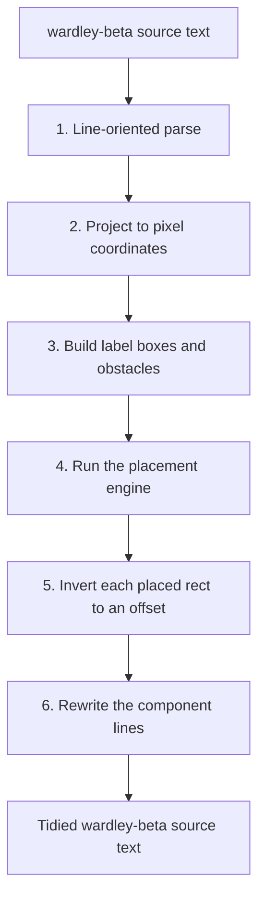
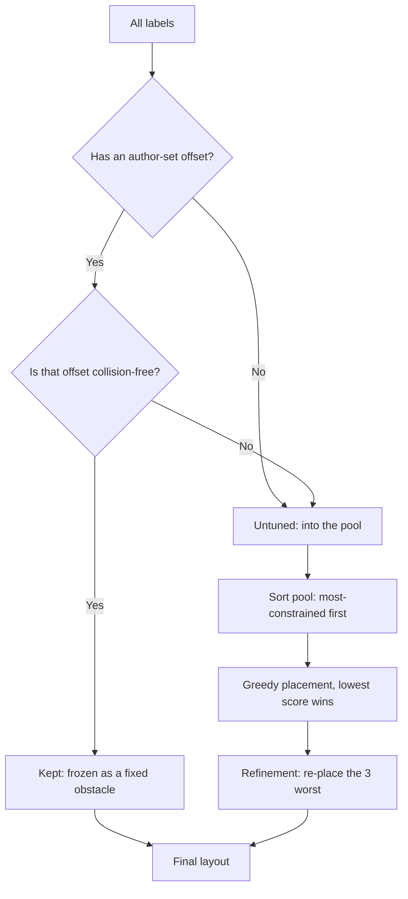

# How ArcKit tidies Wardley Map labels: a deterministic placement engine, stepped through

A Wardley Map is only as useful as it is readable. ArcKit's `/arckit:wardley` command renders each map as a Mermaid `wardley-beta` block, and Mermaid draws every component label at the same default offset from its node. On a sparse map that is fine. On a real strategic map, where related components naturally cluster, those default labels land on top of each other and on top of neighbouring nodes. The map is correct and unreadable at the same time.

ArcKit v5 fixes this automatically. A PostToolUse hook watches for Wardley artefacts being written and rewrites the `label [x, y]` offsets in the Mermaid block so no two labels collide. The hook itself is small. The interesting part is the placement engine it calls, a pure, deterministic optimiser that decides where forty or fifty labels should sit. This article steps through that algorithm in full.

## Where the hook sits

An ArcKit Wardley artefact is a Markdown file holding two fenced code blocks: a canonical `wardley` block in OnlineWardleyMaps syntax, and a `mermaid` block in `wardley-beta` syntax for rendering. The tidy hook is deliberately narrow. It touches only the `mermaid` block. The OWM block, the prose, the Document Control table and everything else are left byte-for-byte unchanged.

The hook fires on `Write` and `Edit`, scoped by a path glob to `projects/**/wardley-maps/**`, and it fails soft: if anything goes wrong, the file is left exactly as written and the turn is never blocked. All the real work happens in two vendored modules that ship alongside the hook, `wardley-tidy.mjs` and `wardley-label-placement.mjs`. Everything below lives in those two files.

## From map source to pixels

Tidying one map is a six-step pipeline. The source text goes in, a rewritten source text comes out, and the labels in between have been treated as a geometry problem.



The reason every step matters is that the placement engine works in pixels, but the map source is written in Wardley coordinates: visibility and evolution, each a number between 0 and 1. To place a label well you have to know where the label and its node will actually be drawn, which means reproducing Mermaid's renderer exactly.

## Steps one to three: parse, project, build the field

**The parse** is line-oriented rather than a full grammar. It walks the source once and recognises the lines that carry geometry: the `size` directive, `component` declarations with their visibility and evolution coordinates and any author-supplied `label` offset, `pipeline` blocks and their child components, and links between components. Anchors, annotations and notes are recorded as obstacles but never relabelled, because the `wardley-beta` grammar has no label offset for them. Everything the parser does not recognise is left verbatim, which is what keeps the rewrite minimal.

**The projection** is an exact replica of Mermaid's `wardley-beta` renderer. The same constants are used: a 900 by 600 canvas, 48 pixels of padding, a 6-pixel node radius, a 10-point label font. A coordinate is projected with

```
chartWidth  = width  - 2 * padding
projectX(v) = padding + (v / 100) * chartWidth
projectY(v) = height - padding - (v / 100) * chartHeight
```

The Y axis is inverted because visibility runs bottom to top on a Wardley Map but top to bottom in screen pixels. Pipelines get a pre-pass of their own: the parent square is repositioned to the midpoint of its children and the pipeline box is recorded as a rectangle.

**Building the field** turns the projected map into the two inputs the engine needs. Every component becomes a `LabelBox`: an anchor point at the node, and a width and height for the label text. The label box is estimated rather than measured, with `width = textLength * fontSize * 0.6` and `height = fontSize * 1.2`. Estimating instead of measuring avoids a DOM round-trip and, more importantly, keeps the result deterministic and testable. Every node, link and pipeline box also becomes an `Obstacle`: a circle for a node marker, a line segment for a link, a rectangle for a pipeline box.

So the engine receives a list of labels that want a home, and a list of obstacles they must avoid.

## Step four: candidates and scoring

The placement engine never solves for a label's position analytically. It generates a fixed set of candidate positions and scores each one. For an ordinary component label there are thirty-two candidates: eight compass directions at four distances from the node.

```
        NW    N    NE
          \   |   /
            \ | /
   W -------- O -------- E      O = node
            / | \              4 rings out: 12, 22, 36, 54 px
          /   |   \
        SW    S    SE
```

Each candidate is the label's bounding box, centred at one of those thirty-two points. Scoring a candidate is a weighted sum of penalties, and lower is better. A score near zero is an unobstructed slot close to the node in the preferred direction.

The penalties are deliberately uneven, because the things they punish are not equally bad:

- Overlapping another label's box costs 5 per square pixel of overlap. Ugly, but survivable.
- Overlapping a node marker costs a flat 800. This is the cardinal sin: a label sitting on a node makes the map actively wrong, so the weight is large enough that no candidate with a marker collision can win against one without.
- Spilling outside the chart bounds costs 50 per square pixel.
- Crossing a link line costs a flat 120.
- Overlapping a pipeline box costs 4 per square pixel.
- Distance from the node costs 0.05 per pixel, a gentle pull inward so labels stay close to what they describe.
- Pointing the wrong way costs up to 6, scaled by how far the candidate's direction deviates from the preferred direction, which is up and to the right by default. Pipeline children prefer to sit underneath instead.

The two soft terms, distance and direction, are what break ties between otherwise-equal slots. They are the reason a tidied map still looks intentional rather than scattered: given two collision-free positions, the engine prefers the closer one in the conventional direction.

## Step five inside step four: most-constrained-first

Scoring tells you how good one position is. It does not tell you the order in which to place labels, and order matters: a label placed early has an empty canvas, a label placed last has to fit around everything else. Placing them in the wrong order gives an early, easy label a slot that a later, desperate label needed.

The engine borrows a classic constraint-satisfaction heuristic: most-constrained-first. Before placing anything, it counts, for each label, how many of its thirty-two candidates are already blocked by obstacles. A label hemmed in by nodes and boundaries has few good options left and is placed first, while the canvas is still open. A label out in clear space is placed last, because it will be fine wherever it lands. Ties are broken by a stable `priority` field so the result never depends on input ordering.



Placement is greedy. Each label in the sorted order is given the lowest-scoring of its candidates, scored against the obstacles plus every label already placed. A single greedy pass can still leave a few labels poorly placed, because the labels placed first could not see the ones that came later. So a refinement pass takes the three worst-scoring labels and re-places them against the now-complete layout. Three is enough in practice: the worst cases are almost always a small number of labels that were boxed in by decisions made after them.

Finally, any label whose chosen position ended up more than 34 pixels from its node is flagged as needing a leader line, so a long offset still reads as belonging to its node.

## Step six and the author: keep what was tuned

Not every label is the engine's to move. An author can write an explicit `label [x, y]` offset on a component, and a good tool does not overrule a human who has deliberately positioned something.

So before placement begins, the engine partitions labels into two groups. Untuned labels, with no author offset, go straight into the pool described above. Manual labels, the ones with an author offset, are first tested for collisions. A manual label is kept exactly as written unless its box overlaps another node's marker, overlaps a pipeline box, spills outside the chart, or overlaps another manual label. Crossing a link line does not, on its own, reject it: link lines are thin, an author who placed a label across one accepted that, and treating every clipped link as a collision would re-place labels that looked perfectly fine.

A kept label is frozen and added to the obstacle list, so the engine routes every other label around it. A manual label that fails the collision test is dropped into the pool and re-placed like any other, except that its score gains a soft pull back toward the position the author originally chose. The author's intent is treated as a strong hint even when it could not be honoured exactly.

## Inversion, rewrite, and the fixpoint

The engine returns a pixel rectangle for each label. Step five of the pipeline inverts that back into the `label [ox, oy]` offset the `wardley-beta` grammar expects, by subtracting the node's pixel position. Step six rewrites only the component lines whose offset actually changed, leaving every other byte of the block alone.

There is one last subtlety. A single tidy pass is not always a fixpoint. The first pass auto-places an untuned map; a second pass re-reads its own output, now sees every label as an authored offset, and a few keep-or-replace decisions can flip. Most maps settle within two passes. A handful have two equally good candidate slots that swap on every pass, a stable two-cycle that never reaches a true fixpoint.

`tidyToFixpoint` handles both. It runs the pass repeatedly until the output stops changing, and if it detects a cycle it returns the lexicographically smallest member of that cycle. The result is that tidying is idempotent: tidying an already-tidied map produces an identical file, which is exactly the property a Write hook needs so it never fights the user with cosmetic churn.

## Why every step is deterministic

The recurring word in this design is deterministic, and that is not an accident. The placement engine is a pure function: the same map in always produces the same map out, on any machine, with no clock, no randomness and no DOM. Label sizes are estimated arithmetically rather than measured in a browser. The placement order is sorted with a stable tie-break. The fixpoint loop canonicalises cycles.

This matters because the engine runs inside a hook on every `Write` and `Edit` of a Wardley artefact. A non-deterministic tidier would rewrite the file differently each time it ran, producing noisy diffs, fighting version control, and making the hook impossible to test. A deterministic one can be unit tested against fixed expected output, runs offline with no install step, and rewrites a file once and then leaves it alone. The algorithm is sophisticated, a weighted soft-constraint optimiser with a constraint-ordering heuristic and a refinement pass, but it behaves like a formatter. That is the point.

You can see it work by running `/arckit:wardley` and watching the `label` offsets appear in the Mermaid block of the artefact it writes. The hook has already tidied them before you open the file.

---

ArcKit is an open-source enterprise architecture governance toolkit for AI coding assistants. The Wardley tidy engine ships with the core plugin. Explore the full command set at [arckit.org](https://arckit.org).
