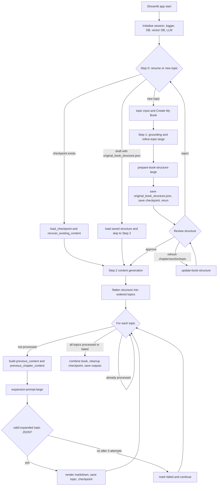

# DeepBook Large Plan Book Flow

This document captures the prompt process used by the DeepBook Streamlit
application for creating a book plan and book content in `large` mode. It is
intended as implementation input for an ArcKit command or agent that replicates
the behavior.

## Evidence Base

- Source repository: `https://github.com/tractorjuice/DeepBook`
- Inspected clone commit: `318776efe29a995da4b52838389df920d479bf36`
- Commit date: `2026-05-03T18:48:14Z`
- Scope inspected: the Streamlit application path only.
- Entry point: `streamlit_app.py`
- Core prompt orchestration: `content/core_book.py`
- Prompt rendering and LLM calls: `llm/prompt_manager.py`,
  `llm/llm_manager.py`
- Local prompt copies for the large path: `prompts/refine-topic-large.txt`,
  `prompts/prepare-book-structure-large.txt`,
  `prompts/expansion-prompt-large.txt`

Excluded from the target behavior: Next.js code, Claude command files,
presentations, YouTube scripts, lesson plans, podcasts, videos, and Wardley map
fan-out. Those are optional branches in the Streamlit app, not part of the
plan-book-only flow.

## Large Mode Boundary

DeepBook selects prompt variants through `st.session_state.features.output_token_limit`.
For this analysis, that setting is forced to `large`.

The Streamlit app defaults to a book-only configuration:

- `enable_book = True`
- `enable_downloads = True`
- `enable_wardleymaps = False`
- `enable_raid = False`
- `enable_presentation = False`
- `enable_youtube = False`
- `enable_lessonplan = False`
- `enable_podcasts = False`
- `enable_chapter_images = False`

The UI only exposes the `small|medium|large` radio to logged-in users. For an
ArcKit command, set `output_token_limit=large` directly instead of depending on
interactive login-gated UI.

## Prompt Inventory For Large Mode

| Stage | Runtime prompt | Runtime ID | Local prompt copy | Output | Parser |
| --- | --- | --- | --- | --- | --- |
| Topic refinement | `refine-topic-large` | `pp-refine-top-78c850` | `prompts/refine-topic-large.txt` | Plain text with `Refined Topic:` and `Key Areas:` | Regex in `streamlit_app.py` |
| Book structure | `prepare-book-structure-large` | `pp-prepare-bo-87a490` | `prompts/prepare-book-structure-large.txt` | JSON book outline | `generate_content_json()`, text fallback |
| Structure refresh | `update-book-structure` | Prompt name, no local large variant found | Portkey-rendered | Replacement text for one target title/subsection | Direct text replacement |
| Topic expansion | `expansion-prompt-large` | `pp-expansion-81fea3` | `prompts/expansion-prompt-large.txt` | JSON expanded topic content | Pydantic validation, 3 attempts |

There is a repository export mismatch: `portkey-prompts/expansion-prompt-large.json`
uses slug `pp-expansion-2488d9`, while the Streamlit runtime maps
`expansion-prompt-large` to `pp-expansion-81fea3`. The `prompts/README.md` and
`prompts/expansion-prompt-large.txt` also identify `pp-expansion-81fea3` as the
large prompt. Treat the Streamlit mapping and `prompts/` file as authoritative
for runtime replication.

## End-To-End Flow



## Step 0: Startup, Resume, Or New Topic

The app starts by creating a stable `session_id`, setting up a session logger,
initialising `FeatureConfig`, setting up vector database state, creating the LLM
manager, and rendering the sidebar.

At `step == 0`, the app first checks for incomplete generations:

- If a checkpoint exists, `load_checkpoint()` restores `book_topic`,
  `book_structure`, `processed_topics`, `failed_topics`, `all_topics`,
  `book_content`, feature flags, grounding knowledge, directory paths, and cost
  counters. It then calls `recover_existing_content()` and resumes at the step
  inferred from checkpoint contents.
- If the incomplete book is a draft with `original_book_structure.json`, the app
  loads that structure, sets `is_structure_created=True`,
  `is_structure_approved=True`, flattens topics if needed, and jumps directly to
  `step=2`.
- If no checkpoint or structure can be used, it sets `initial_topic` to the saved
  book topic and resumes at `step=1`.
- A new run starts when the user enters a topic and clicks `Create My Book`.
  `start_step_1()` records `start_time` and sets `step=1`.

ArcKit implication: the command should support a resumable state file with the
same core fields: initial topic, refined topic, key areas, book structure,
ordered topic list, processed topics, failed topics, topic content, output
directory, feature settings, and model/cost metadata.

## Step 1A: Grounding Input Assembly

Before the first prompt, DeepBook assembles `grounding_knowledge`.

Inputs:

- `features.reference_url`
- `features.reference_file`
- optional search toggles in later prompt functions

If a URL exists, `process_uploaded_and_url_content()` fetches the URL and also
includes uploaded file text if a file exists. Immediately after that, the
Streamlit app has a separate uploaded-file block that appends the uploaded text
again. Therefore, when both URL and file are supplied, the Streamlit behavior can
duplicate uploaded file grounding text.

For a faithful clone, preserve this behavior. For an improved ArcKit command,
deduplicate grounding deliberately and document that it differs from the
Streamlit implementation.

## Step 1B: Prompt 1, Topic Refinement

Function: `content.core_book.refine_topic()`

Runtime selection in large mode:

```text
prompt_name = refine-topic-large
prompt_id = pp-refine-top-78c850
temperature = 0.3
output = plain text
```

Variables:

- `initial_topic`
- `external_knowledge`

Prompt technique:

- Acts as a book publishing and market trends expert.
- Keeps the initial topic rather than changing it.
- Produces a marketable book concept with subtitle, rationale, key areas, and
  differentiation.
- The large prompt asks for comprehensive market positioning, target audience
  analysis, methodologies, cross-disciplinary connections, controversies,
  competitive positioning, and series potential.

Expected response shape:

```text
Refined Topic: ...
Potential Subtitle: ...
Explanation: ...
Key Areas:
1. ...
2. ...
...
Differentiation: ...
```

Runtime handling:

- The app clears the LLM prompt cache before refinement.
- If knowledge toggles are enabled, `retrieve_wardley_knowledge()` can append
  retrieved knowledge to `external_knowledge`.
- `generate_content_text()` sends the rendered prompt to the current model.
- If the response is empty, refinement fails and the app stops.
- If `Refined Topic:` is missing, refinement returns `None` and the app stops.
- If `Key Areas:` is missing, the app warns but continues with an empty
  `key_areas` list.
- `streamlit_app.py` extracts the refined topic with a regex that captures text
  after `Refined Topic:` up to the next newline.
- It extracts key areas from the `Key Areas:` block until the next blank line or
  end of string, strips numeric prefixes, then sets `book_topic=refined_topic`.

Important replication detail: the prompt says "Keep the initial topic", but the
runtime still treats the parsed `Refined Topic:` value as the canonical
`book_topic` for subsequent prompts.

## Step 1C: Prompt 2, Book Structure

Function: `content.core_book.generate_book_structure_from_topic()`

Runtime selection in large mode:

```text
prompt_name = prepare-book-structure-large
prompt_id = pp-prepare-bo-87a490
temperature = 0.3
primary output = JSON
fallback output = text parsed into a minimal JSON structure
```

Variables:

- `topic`: the refined `book_topic`
- `key_areas`: newline-joined key area list
- `external_knowledge`: accumulated grounding knowledge plus optional retrieved
  knowledge

Optional knowledge fork:

- If any of `enable_bok_search`, `enable_wardley_book_search`,
  `enable_openai_web_search`, or `enable_google_web_search` are enabled, the app
  calls `retrieve_wardley_knowledge(topic)`.
- `retrieve_wardley_knowledge()` loops over enabled sources: Wardley Book, Body
  of Knowledge, OpenAI Web Search, and Google Web Search. Disabled sources are
  skipped.
- Retrieved source content is appended under an `### EXTERNAL KNOWLEDGE ###`
  boundary.

Prompt technique:

- Casts the model as a distinguished author, book structuring expert, and
  publishing strategist.
- Asks for a definitive non-fiction book structure.
- Requires strategic title development, 4 to 6 chapters, 4 to 6 sections per
  chapter, and 4 to 6 subsections per section.
- Requires market positioning, audience alignment, learning progression,
  practical application, competitive analysis, redundancy/gap analysis, and
  long-term scalability.
- Asks for a detailed planning area named `structure_development`.

Expected JSON shape:

```json
{
  "structure_development": {
    "brainstormed_titles": [],
    "chapter_breakdown": [],
    "section_subsection_purpose": [],
    "overall_structure_review": ""
  },
  "title": "Final Selected Comprehensive Book Title",
  "chapters": [
    {
      "title": "Complete Chapter Title",
      "sections": [
        {
          "title": "Complete Section Title",
          "subsections": [
            "Subsection Title 1: Specific Focus Area"
          ]
        }
      ]
    }
  ],
  "consistency_report": {
    "overall_structure_assessment": "",
    "chapter_consistency": "",
    "section_subsection_coherence": "",
    "areas_for_improvement": "",
    "market_appeal": "",
    "topic_specific_considerations": "",
    "balance_of_content": "",
    "innovation_assessment": "",
    "scalability_analysis": ""
  }
}
```

Runtime handling:

- `generate_content_json()` invokes the model and parses with `json_repair`.
- If JSON generation throws, the app falls back to `generate_content_text()` and
  `_parse_structured_text_to_json()`.
- The text fallback is lossy. It searches for a title containing `Procurement`,
  then chapter patterns. If parsing fails, it creates a generic default
  structure.
- If `original_topic` was supplied, it adds `book_structure["original_topic"]`.
- If memory storage is enabled and the selected model is a Google model, it
  stores a `book_structure_creation` memory context.
- `streamlit_app.py` adds a `generation_config` block containing selected model,
  detail level, feature flags, session metadata, and initial token counters.
- It creates `./books/{session_id}/{safe_book_title}` plus subdirectories for
  other content types, even if plan-book-only features do not use them.
- It writes `original_book_structure.json`.
- It sets `is_structure_created=True`, sets `step=2`, saves a checkpoint, and
  reruns the app.

## Step 2A: Structure Review And Refresh Fork

When `step == 2` and `is_structure_approved` is false, the app renders the
generated outline for human review.

User choices:

- Approve: `on_approve_click()` checks billing entitlement and sets
  `is_structure_approved=True`.
- Reject: `reset_app_state()` clears generation state and returns to the start.
- Refresh a chapter title, section title, or subsection title:
  `on_topic_refresh_click()` calls `refresh_and_update()`.

Refresh prompt flow:

```text
update_book_structure()
  -> _get_update_target()
  -> llm_manager.invoke_prompt("update-book-structure", {
       JSON: full current structure,
       TEXT: selected title/subsection text,
       COUNT: character count
     })
  -> generate_content_text(temperature=0.5)
  -> _apply_update()
  -> st.session_state.book_structure = updated_structure
```

The refresh prompt updates only one string at a time. It does not rebuild the
whole outline and it does not run the large structure prompt again.

ArcKit implication: include an outline revision loop before content generation.
For non-interactive command use, this can be represented as either a user-edit
checkpoint or a "revise selected node" subcommand.

## Step 2B: Topic List And Placeholders

After approval, the app flattens the outline:

```text
for chapter in structure["chapters"]:
  for section in chapter["sections"]:
    for subsection in section["subsections"]:
      topics.append((subsection, section["title"], chapter["title"]))
```

The resulting `all_topics` list defines generation order. It is strictly
chapter order, then section order, then subsection order.

For each chapter/section/topic, the app initialises a `TopicContent()` object.
For the book-only flow, the relevant field is:

```json
{
  "book": {
    "content": ":material/pending_actions: Pending Section Creation ...",
    "content_wardleymap": "",
    "raid_content": ":material/pending_actions: Pending RAID Creation ...",
    "status": "pending"
  }
}
```

## Step 2C: Per-Topic Generation Loop

Main loop:

```text
for i, (topic, section_title, chapter_title) in enumerate(all_topics, 1):
  locate current TopicContent
  if missing structure element: mark failed and continue
  if i > MAXTOPICS: write test file, mark processed, checkpoint, continue
  if topic name appears in processed_topics: skip
  if tuple is in failed_topics: remove it, then retry
  if enable_book: generate core book content
```

`processed_topics` stores tuples shaped as `(topic, section_title, chapter_title)`.
The skip check only compares the topic string against the first tuple element.
If two sections reuse the same subsection title, the later one can be skipped
incorrectly. A faithful clone would preserve this behavior; an ArcKit
implementation should probably use the full tuple key.

Previously failed topics are retried by removing their tuple from
`failed_topics` at the start of processing. If they fail again, they are added
back to `failed_topics`.

## Step 2D: Previous Content Context Builder

Before calling the expansion prompt, the app builds two context strings:

- `previous_chapter_content`: content from already processed topics in the same
  chapter.
- `previous_content`: content from already processed topics in other chapters.

Algorithm:

1. Iterate over `processed_topics`, excluding the current topic by topic title.
2. Assign priority `1` for same chapter, `2` for other chapters.
3. Calculate recency as `len(processed_topics) - idx`.
4. Sort by `(priority, -recency)`.
5. For each sorted topic, read content from `session_state.book_content` first.
6. If session state has no content, read the saved topic markdown file.
7. Prefix each included block with:

```text
## {prev_chapter} - {prev_section} - {prev_topic}

{prev_content}
```

8. Enforce limits:
   - `content_limit` comes from the selected model `context_limit`, or
     `default_context_limit=200000`.
   - `chapter_limit=50000`.
   - If adding a block exceeds a limit and more than 100 characters remain, the
     app appends a truncated block ending with `...[truncated]`.
9. Same-chapter content goes only into `previous_chapter_content`; other chapter
   content goes only into `previous_content`.

This context construction is a key DeepBook pattern. Later topics are not
independent. They build on earlier generated material, with same-chapter content
preferred over cross-chapter material.

## Step 2E: Prompt 3, Topic Expansion

Function: `content.core_book.prepare_expansion_prompt()`

Runtime selection in large mode:

```text
prompt_name = expansion-prompt-large
prompt_id = pp-expansion-81fea3
temperature = 0.3
validation attempts = 3
```

Variables:

- `BOOK_TOPIC`: refined book topic
- `TOPIC`: current subsection title
- `SECTION_TITLE`: containing section title
- `CHAPTER_TITLE`: containing chapter title
- `BOOK_OUTLINE_JSON`: full book structure JSON
- `EXTERNAL_KNOWLEDGE`: grounding knowledge plus optional retrieved knowledge
- `PREVIOUS_CONTENT`: generated content from other chapters
- `PREVIOUS_CHAPTER_CONTENT`: generated content from same chapter
- `SECTOR_CONTEXT`
- `EXAMPLE_SOURCES`
- `TARGET_AUDIENCE`
- `SECTOR_GUIDANCE`

Sector defaults:

- Default sector is `government`.
- Other supported sectors are `neutral`, `healthcare`, `finance`, and
  `technology`.
- Sector selection changes example sources, target audience, and guidance text
  passed into the prompt.

Optional knowledge fork:

- Just before prompt rendering, `prepare_expansion_prompt()` can call
  `retrieve_wardley_knowledge(topic, context)`.
- The context string is `{topic}. {section_title}. {chapter_title}. {book_topic}.`
- Retrieved knowledge is appended to `EXTERNAL_KNOWLEDGE` under the same
  `### EXTERNAL KNOWLEDGE ###` boundary.

Prompt technique:

- Casts the model as an expert content developer, author, consultant, and thought
  leader.
- Requires the model to analyse book topic, full outline, external knowledge,
  current topic, section, chapter, and previous content.
- Explicitly uses narrative continuity through `previous_content` and
  `previous_chapter_content`.
- Asks for content planning across concept analysis, content architecture, case
  studies, accessibility, critical perspectives, structure, engagement, practical
  application, voice, and evidence.
- Targets 1,200 to 1,800 words per subsection.
- Requires H4 headings only for sub-subsection headings.
- Encourages detailed examples, practical applications, pitfalls, action items,
  and placeholders for Wardley maps or images when relevant.
- Requires UK English.
- Prohibits en dashes in generated text.
- Requires a single valid JSON object with no text outside JSON.

Expected JSON shape:

```json
{
  "title": "Complete Section Title",
  "content": [
    {
      "type": "paragraph",
      "text": "Comprehensive content here..."
    },
    {
      "type": "heading",
      "text": "Heading text without markdown syntax",
      "level": 4
    },
    {
      "type": "list",
      "text": "Optional list lead-in",
      "items": ["Item 1", "Item 2"]
    },
    {
      "type": "quote",
      "text": "Quote text without internal quotation marks"
    },
    {
      "type": "placeholder",
      "text": "[Insert Image: ...]"
    }
  ]
}
```

The validator also permits `code`, `image`, `wardleymap_quote`, and
`wardleymap_assessment` item types, although the large prompt lists only
`paragraph`, `heading`, `list`, `quote`, and `placeholder`.

## Step 2F: Prompt Rendering And Model Execution

All three major prompts use this two-step pattern:

```text
PromptManager.render_prompt(prompt_id, variables)
  -> Portkey render API
  -> LangChain SystemMessage/HumanMessage list
generate_content_text/json(messages)
  -> optional memory enhancement
  -> optional style enhancement
  -> current provider model invoke
```

`PromptManager.render_prompt()` retries render failures up to 3 times for
retryable infrastructure errors such as 500s, timeouts, connection, or network
errors. It uses exponential backoff starting at 0.5 seconds.

`generate_content_text()` and `generate_content_json()` are wrapped in a Tenacity
retry decorator:

- Max attempts: 3
- Retriable exceptions: selected API errors, rate limits, request exceptions,
  `ValueError`, and `JSONDecodeError`
- Wait strategy:
  - 500/502/503/504: 5s, 10s, 20s capped
  - 529 overload: 10s, 20s, 40s capped
  - rate limit with `Retry-After`: honor header
  - rate limit without header: 8s, 16s, 32s capped
  - 400 API error: 3s, 6s, 12s capped
  - default: 5s, 10s, 20s capped

If a provider error says API usage limits are reached and includes a resume date,
the app shows a hard UI error and stops.

## Step 2G: Expansion Validation Loop

DeepBook validates expanded topic JSON separately from provider retries.

Function: `validation.simple_validator.generate_valid_topic_json()`

Loop:

```text
for attempt in 1..3:
  result = generate_content_json(prompt, temperature=0.3)
  reject if any list item starts with "#"
  try Pydantic ExpandedTopic validation
  if valid: return model_dump()
  if validation fails:
    if response appears truncated: continue
    recovered = apply_simple_recovery(result)
    try Pydantic validation again
    if valid: return model_dump()
    else continue
raise ValueError
```

Validation schema:

- Root object: `ExpandedTopic`
- Required `content`: list of 1 to 200 content items
- Optional `title`: string up to 200 characters
- `paragraph.text`: 1 to 10000 characters
- `heading.text`: 1 to 200 characters
- `heading.level`: 4 or 5 only
- `list.items`: 1 to 20 items; string items must not start with `#`
- `quote.text`: 1 to 2000 characters
- `code.text`: 1 to 5000 characters
- `placeholder.text`: 1 to 2000 characters
- `wardleymap_assessment.text`: 1 to 3000 characters

Recovery rules:

- If the LLM returns a list, wrap it as `{"content": list}`.
- If the LLM returns a string, wrap it as one paragraph item.
- Otherwise return the response unchanged and retry validation.

If all attempts fail, the topic is marked failed and the outer topic loop
continues.

## Step 2H: Topic Rendering, Save, And Checkpoint

If expanded topic JSON validates, `process_book_content()` converts the `content`
list to markdown.

Rendering behavior:

- Uses `utils.content_renderer.convert_content_list_to_markdown()` first.
- Falls back to item-by-item rendering if conversion fails.
- Supports paragraphs, lists, quotes, code, headings, placeholders, and
  Wardley-specific content types.
- If image generation is enabled, it scans the markdown for image placeholders
  and generates images. In plan-book-only scope this remains disabled.

After rendering:

- `current_state["book"]["content"] = full_subsection_text`
- `current_state["book"]["status"] = "complete"`
- The app displays the content in the Streamlit book tab.
- It writes the topic markdown file using `build_topic_path()`.
- It appends the full topic tuple to `processed_topics`.
- It saves a checkpoint.
- If a database record exists, it updates completed and failed topic counts.

If content processing or saving fails:

- The app stores an error string in the topic state.
- It marks status as `error`.
- It appends the topic tuple to `failed_topics`.
- It continues the outer loop.

## Optional Branches After Core Book Content

After the book content branch, the Streamlit loop can generate:

- RAID log
- Wardley map OWM text
- Wardley map image
- Wardley map audio or video walkthrough
- Wardley map reports
- Component evaluations
- MARP presentations
- YouTube scripts
- Lesson plans
- Podcast scripts, audio, transcripts, and videos

For plan-book-only replication, keep these disabled. Do not call their prompts or
media generators.

The one exception worth preserving as metadata: the app still creates directories
for YouTube, presentations, lessons, and podcasts after structure generation,
even when those features are disabled.

## Completion Loop

After the outer topic loop:

```text
total_topics = len(all_topics)
processed_topics = len(processed_topics)
failed_topics = len(failed_topics)
completed_count = processed_topics + failed_topics
```

If `completed_count >= total_topics`:

- The app reports success if `failed_topics == 0`.
- It reports completion with warnings if failures exist.
- It deletes the checkpoint.
- It computes total generation time.
- It calls `auto_save_complete_book()`.
- It updates metering and database completion status.

For book-only output, `auto_save_complete_book()`:

- Calls `combine_book_content(book_directory, book_title, all_topics, total_time)`.
- Writes `{safe_book_title}.md`.
- Creates a ZIP archive for the book directory.
- Stores extracted content in the database when a book record exists.

`combine_book_content()` loops through `all_topics` again in outline order and
reads each topic markdown file. Missing topic files are skipped with a warning.
It appends a "Book Creation Details" section containing original topic, refined
topic, model, output detail level, generation time, token usage, estimated cost,
feature configuration, knowledge sources, and external services.

## ArcKit Replication Requirements

To replicate the large plan-book flow in ArcKit, implement these stages:

1. Collect inputs:
   - initial topic
   - optional reference URL/file text
   - sector, default `government`
   - selected model and max tokens for `large`
   - optional search toggles

2. Run topic refinement:
   - render `refine-topic-large` with `initial_topic` and
     `external_knowledge`
   - call the model at temperature `0.3`
   - require `Refined Topic:`
   - parse `Key Areas:` if present

3. Run book structure generation:
   - render `prepare-book-structure-large`
   - call JSON generation at temperature `0.3`
   - repair/parse JSON
   - retain full structure metadata, including `structure_development` and
     `consistency_report`
   - add original topic and generation config
   - persist structure before content generation

4. Provide a review loop:
   - allow accept/reject
   - allow targeted refresh of chapter, section, or subsection title
   - refresh only the selected node, not the whole outline

5. Flatten the approved structure:
   - ordered list of `(subsection, section_title, chapter_title)`
   - use full tuple identity, unless exact Streamlit bug compatibility is
     required

6. For each topic:
   - skip already processed tuple
   - retry previously failed tuple
   - build same-chapter and cross-chapter context from prior generated topic
     markdown
   - render `expansion-prompt-large`
   - call JSON generation at temperature `0.3`
   - validate with the same content schema
   - retry validation up to 3 attempts
   - render JSON content to markdown
   - save topic markdown
   - checkpoint after each successful topic
   - mark failures and continue

7. Complete:
   - treat processed plus failed topics as loop completion
   - combine topic files in outline order
   - add generation metadata
   - write the final markdown book
   - keep a resume state until completion, then clean it up

## Fidelity Notes

- The large flow is not a single prompt. It is a stateful prompt chain with a
  human approval loop and a per-topic generation loop.
- The structure prompt creates the plan. The expansion prompt writes the book
  content for each plan leaf.
- Topic expansion depends on all previous successful topic outputs. This is the
  main continuity technique.
- Validation retries are separate from API retries.
- Failed topics do not stop the book. They are tracked and count toward
  completion.
- The Streamlit implementation can duplicate uploaded file grounding when both
  URL and file inputs are supplied.
- The Streamlit skip logic compares only topic titles for already processed
  topics. Use full tuple identity in ArcKit unless bug compatibility is needed.
- Local prompt exports contain a large expansion slug mismatch. Runtime code
  maps the large expansion prompt to `pp-expansion-81fea3`.
- Memory-bank and style-profile prompt enhancement are optional wrappers. They
  are off by default and should not be required for the ArcKit baseline.

## Source Reference Map

- `DeepBook:streamlit_app.py:18-39` session ID initialization.
- `DeepBook:streamlit_app.py:130-165` session, vector DB, and LLM initialization.
- `DeepBook:streamlit_app.py:409-560` resume interface and resume forks.
- `DeepBook:streamlit_app.py:560-574` `start_step_1()`.
- `DeepBook:streamlit_app.py:776-983` Step 0 topic input, grounding,
  refinement, structure generation, structure save, checkpoint.
- `DeepBook:streamlit_app.py:985-1078` structure review, approve/reject,
  refresh buttons, flattening.
- `DeepBook:streamlit_app.py:1083-1207` topic placeholders, tabs, database book
  record, start of topic loop.
- `DeepBook:streamlit_app.py:1207-1373` per-topic loop setup, skip and retry
  behavior.
- `DeepBook:streamlit_app.py:1380-1501` previous-content context construction
  and expansion validation call.
- `DeepBook:streamlit_app.py:1519-1578` topic markdown rendering, save,
  processed topic tracking, checkpoint.
- `DeepBook:streamlit_app.py:2486-2579` completion criteria, checkpoint cleanup,
  auto-save, metering updates.
- `DeepBook:content/core_book.py:15-28` prompt ID mapping.
- `DeepBook:content/core_book.py:668-832` large structure prompt selection,
  JSON generation, fallback parsing, original topic metadata.
- `DeepBook:content/core_book.py:834-1025` expansion prompt variable binding,
  sector variables, cache-control message wrapping.
- `DeepBook:content/core_book.py:1267-1375` topic refinement prompt selection
  and response checks.
- `DeepBook:content/book_structure.py:26-314` targeted structure refresh.
- `DeepBook:llm/prompt_manager.py:38-98` Portkey render and render retry.
- `DeepBook:llm/llm_manager.py:381-459` provider retry policy and max token
  selection.
- `DeepBook:llm/llm_manager.py:472-535` JSON generation and `json_repair`
  parsing.
- `DeepBook:llm/llm_manager.py:536-587` text generation.
- `DeepBook:validation/simple_validator.py:8-100` expanded topic schema.
- `DeepBook:validation/simple_validator.py:127-276` validation and recovery
  retry loop.
- `DeepBook:utils/state.py:5-59` default feature configuration.
- `DeepBook:utils/state.py:87-159` `TopicContent` shape.
- `DeepBook:utils/utils.py:188-202` `flatten_structure()`.
- `DeepBook:utils/checkpoint.py:35-115` checkpoint save.
- `DeepBook:utils/checkpoint.py:117-220` checkpoint load and step inference.
- `DeepBook:search/grounding.py:119-176` URL/file grounding assembly.
- `DeepBook:utils/wardleymap_utils.py:28-112` optional knowledge source loop.
- `DeepBook:prompts/refine-topic-large.txt:5-40` large refinement prompt.
- `DeepBook:prompts/prepare-book-structure-large.txt:5-207` large structure
  prompt.
- `DeepBook:prompts/expansion-prompt-large.txt:5-104` large expansion prompt.
