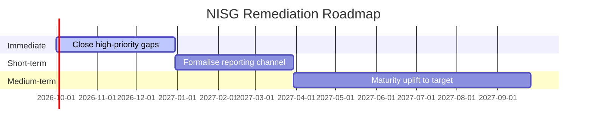

# Austrian NISG 2026 (NIS2 Transposition) Assessment

> **Template Origin**: Community | **ArcKit Version**: [VERSION] | **Command**: `/arckit-at:at-nisg`
>
> ⚠️ **Community-contributed** — not yet validated against the enacted NISG 2026 / A-SIT / EU regulatory text. Verify all citations before relying on output. The **NISG 2026 (BGBl. I Nr. 94/2025)** is a standalone act that replaces the NISG 2018; it enters into force **1 October 2026 (§51)**, with registration due by 31 December 2026 (§29). Its implementing ordinances are still forthcoming; items marked `[NEEDS VERIFICATION]` — including all paragraph (§) references — must be confirmed against the enacted text.

## Document Control

<!-- DOC-CONTROL-HEADER -->
<!-- Resolved at command-execution time to _partials/document-control-uk.md or _partials/document-control-uae.md based on plugin userConfig classification_scheme + governance_framework. See _partials/RENDERING.md (when present). -->

## Revision History

| Version | Date | Author | Changes | Approved By | Approval Date |
|---------|------|--------|---------|-------------|---------------|
| [VERSION] | [YYYY-MM-DD] | ArcKit AI | Initial creation from `/arckit-at:at-nisg` | [PENDING] | [PENDING] |

## Executive Summary

| Pillar | Status | Critical Gaps |
|--------|--------|--------------|
| Austrian Scoping | [Essential / Important / Out of scope] | [Count] |
| Governance | [Compliant / Partial / Gap] | [Count] |
| Risk Management | [Compliant / Partial / Gap] | [Count] |
| Incident Reporting (CSIRT) | [Compliant / Partial / Gap] | [Count] |
| Supply Chain | [Compliant / Partial / Gap] | [Count] |
| Business Continuity | [Compliant / Partial / Gap] | [Count] |

---

## 1. Austrian Scope and Designation

### 1.1 Sector Classification

| NIS2 Annex | Sector / Sub-sector | Applicable | AT Competent Authority |
|------------|---------------------|-----------|------------------------------------------------|
| I | Energy (Electricity) | ☐ | E-Control |
| I | Energy (Gas / Oil / Hydrogen) | ☐ | E-Control |
| I | Transport (Air / Rail / Water / Road) | ☐ | BMK |
| I | Banking / Financial Market | ☐ | FMA / OeNB |
| I | Health | ☐ | BMSGPK / ELGA |
| I | Drinking Water / Wastewater | ☐ | BMK / Land authorities |
| I | Digital Infrastructure / ICT | ☐ | BMI / RTR |
| I | Public Administration | ☐ | BMI (federal) / Land |
| I | Space | ☐ | BMK |
| II | Postal / Courier / Waste / Chemicals / Food | ☐ | Sectoral |
| II | Manufacturing / Digital providers / Research | ☐ | Sectoral |

### 1.2 Designation

| Item | Value |
|------|-------|
| Entity Designation | [Essential / Important / Out of scope] |
| Previous NISG 2018 status | [Betreiber wesentlicher Dienste / None] |
| Main establishment | [AT / other EU MS] |
| Cross-border operations | [List MS] |
| Size threshold result | [≥250 emp / 50–250 / <50 / micro] |

---

## 2. Governance (NIS2 Art. 20 → §31)

| Obligation | Status | Evidence / Gap |
|-----------|--------|----------------|
| Geschäftsleitung approves security measures (§31) | [Yes / Partial / No] | |
| Management body responsibility acknowledged (NIS2 Art. 20 → §31) | [Yes / Partial / No] | |
| Management body cyber training completed (§31) | [Yes / Partial / No] | |
| Responsibility mapped (CISO / Sicherheitsbeauftragter) | [Yes / Partial / No] | |

---

## 3. Risk Management Measures (NIS2 Art. 21 → §32)

| # | Measure | Status | Gap | Proportionality Note |
|---|---------|--------|-----|----------------------|
| 1 | Risk analysis policy | | | |
| 2 | Incident handling | | | |
| 3 | Business continuity / BCM | | | |
| 4 | Supply chain security | | | |
| 5 | Secure acquisition / development / maintenance | | | |
| 6 | Policies to assess effectiveness | | | |
| 7 | Cyber hygiene + training | | | |
| 8 | Cryptography policy | | | |
| 9 | HR security + access control | | | |
| 10 | MFA + secure communications | | | |

A-SIT guidance alignment (sector-agnostic security guidance, commonly referenced by BMI/sectoral authorities): [Summary]

---

## 4. Incident Reporting — Austrian Channel (§34)

| Item | Status | Evidence / Gap |
|------|--------|----------------|
| Reporting to the responsible CSIRT (§8) via the national NIS2-Meldeplattform established — CERT.at (national CSIRT), GovCERT (public-admin sectoral CSIRT); the CSIRT forwards to the Cybersicherheitsbehörde (§34) | | |
| Registration with the Cybersicherheitsbehörde (§3a) completed (§29) | | |
| 24-hour early warning capability (§34) | | |
| 72-hour notification capability (§34) | | |
| Intermediate (on request) / 1-month final report process (§34) | | |
| Cross-reporting to DSB for personal data breach (Art. 33 GDPR) | | |
| Reporting language / form readiness (German, NIS2-Meldeplattform) | | |
| Tabletop exercise in last 12 months | | |

---

## 5. Supply Chain Security

| Control | Status | Evidence / Gap |
|---------|--------|----------------|
| Supplier inventory maintained | | |
| Third-party risk assessment | | |
| Contractual security clauses | | |
| Software supply chain (SBOM / patching) | | |
| ENISA supply chain framework alignment | | |
| Sectoral secondary rules (E-Control Verordnungen / FMA Rundschreiben) | | |
| High-risk vendor treatment (5G / EU toolbox) | | |

---

## 6. Business Continuity and Resilience

| Item | Status | Evidence / Gap |
|------|--------|----------------|
| BCP documented and current | | |
| Backup + restore tested in last 12 months | | |
| Crisis management procedure | | |
| RTO defined | [Value] | |
| RPO defined | [Value] | |
| Alternate site / DR capability | | |

---

## 7. Supervision, Inspections, and Penalties

| Item | Status | Notes |
|------|--------|-------|
| Supervisory posture | [Ex ante (Essential) / Ex post (Important)] | |
| Lead supervisor | Cybersicherheitsbehörde (Bundesamt für Cybersicherheit) | |
| Maximum penalty (§45) | Essential: ≥ €10M / 2% turnover; Important: ≥ €7M / 1.4% turnover (NIS2 Art. 34 floor) | |
| Appeal pathway | BVwG | |
| CISO / Sicherheitsbeauftragter designated | [Yes / No] | |

### 7.1 Unabhängige Stellen und unabhängige Prüfer (§7)

| Item | Status | Notes |
|------|--------|-------|
| Independent body / auditor (§7) engaged for the Wirksamkeitsnachweis (§33) | [Yes / No / Planned] | |
| Eligibility / accreditation confirmed | [Yes / No] | |
| Scope of assessment | [Full / Partial] | |
| Last assessment date | [YYYY-MM-DD / N/A] | |
| Findings remediated | [Yes / Partial / No] | |

---

## 8. KSÖ and National Cyber Coordination

| Item | Status | Notes |
|------|--------|-------|
| KSÖ membership / participation | [Member / Observer / None] | Voluntary |
| Cybersicherheitsbehörde contact — competent authority (§3a), zentrale Anlaufstelle/EU SPOC (§5) | [Yes / No] | |
| CSIRT operative contact (§8) — CERT.at / GovCERT | [Yes / No] | |
| Information-sharing MoUs | [List] | |

### 8.1 National coordination structures (§§12–14)

| Item | Status | Notes |
|------|--------|-------|
| Awareness of the Cyber Sicherheit Steuerungsgruppe (CSS, §12) role | [Yes / No] | |
| Awareness of IKDOK (§13) / OpKoord (§14) operative coordination | [Yes / No] | |
| Communication channel to national coordination established | [Established / Gap] | |
| Internal escalation to crisis threshold defined | [Yes / No] | |
| Cross-sector coordination readiness | [Yes / Partial / No] | |

---

## 8b. Austrian NISG 2026 Additions Beyond NIS2 Baseline

> § references map to the enacted NISG 2026 (BGBl. I Nr. 94/2025). Sectors are set out in **Anlagen 1/2**; scope of wesentliche/wichtige Einrichtungen in **§24**. Confirm the exact wording against the official text before external reliance.

| Austrian Addition | NISG 2026 Reference | NIS2 Equivalent | Compliance Status |
|-------------------|---------------------|-----------------|-------------------|
| Bundesamt für Cybersicherheit (single monocratic authority under BMI) | §3a (Aufgaben §4) | Art. 8 competent authority | |
| Zentrale Anlaufstelle / SPOC + Nationales Koordinierungszentrum | §5, §6 | Art. 8(3) SPOC | |
| Unabhängige Stellen und unabhängige Prüfer (accredited assessment bodies) | §7 | No direct equivalent (Art. 32(2) allows, not mandates) | |
| Computer-Notfallteams / CSIRTs — CERT.at (national), GovCERT (public-admin sectoral) | §§8–11 | Art. 10–11 CSIRTs | |
| National coordination bodies — CSS, IKDOK, OpKoord | §§12–14 | Art. 8/9 (less structured) | |
| Land-level bodies scope / opt-in mechanism | `[VERIFY §]` (NISG 2026 is federal law) | No equivalent (federal-only in most MS) | |
| Designation beyond size thresholds on criticality | `[VERIFY §]` (see §24 scope) | Art. 2(2)(b-e) similar but EU-level | |

---

## 9. Gap Analysis and Roadmap

| Domain | Current Maturity | Target | Priority | Owner | Target Date |
|--------|-----------------|--------|----------|-------|-------------|
| Risk analysis | L1–L5 | L1–L5 | 🔴/🟠/🟡 | | |
| Incident handling | L1–L5 | L1–L5 | | | |
| BCM | L1–L5 | L1–L5 | | | |
| Supply chain | L1–L5 | L1–L5 | | | |
| Governance | L1–L5 | L1–L5 | | | |

---

## External References

### Document Register

| DOC_ID | Source | Description |
|--------|--------|-------------|
| | | |

### Citations

| Citation | Used In | Source |
|----------|---------|--------|
| | | |

---

**Generated by**: ArcKit `/arckit-at:at-nisg` command
**Generated on**: [DATE]
**ArcKit Version**: [VERSION]
**Project**: [PROJECT_NAME]
**Model**: [AI_MODEL]
